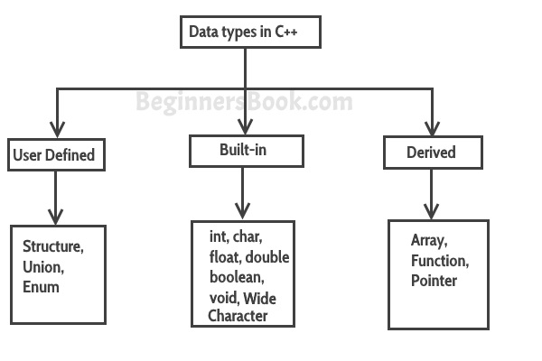
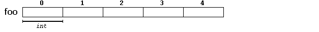

#                    **Basics Of C++**

## **Table Of Contents :**
  - [**To run a .cpp file on your terminal**](#to-run-a-cpp-file-on-your-terminal)
  - [**Variables and Data Types:**](#variables-and-data-types)
  - [**Type Casting:**](#type-casting)
  - [**Namespace:**](#namespace)
  - [**Conditional Statements:**](#conditional-statements)
  - [**Control Loops:**](#control-loops)
  - [**Enumeration:**](#enumeration)
  - [**Functions:**](#functions)
  - [**Classes And Objects:**](#classes-and-objects)
  - [**Templates:**](#templates)
  - [**Arrays :**](#arrays-)
    - [**Initializing Arrays :**](#initializing-arrays-)
    - [**Array Accessing :**](#array-accessing-)
    - [**Printing 1-D Array:**](#printing-1-d-array)
    - [**Multidimensional Arrays :**](#multidimensional-arrays-)
    - [**Printing a 2D Array:**](#printing-a-2d-array)
  - [**Pointers :**](#pointers-)
  - [**Pointers And Array :**](#pointers-and-array-)
  - [**Passing 2D Array To A Function :**](#passing-2d-array-to-a-function-)
  - [**Vectors :**](#vectors-)
## **To run a .cpp file on your terminal**
```md
Compile the .cpp file with following command:
$ g++ <filename>.cpp
Followed by running the executable, with this command:
$ ./a.out

```

## **Variables and Data Types:**
A variable provides us with named storage that our programs can manipulate. Each variable in C++ has a specific type, which determines the size and layout of the variable's memory; the range of values that can be stored within that memory; and the set of operations that can be applied to the variable.




## **Type Casting:**
 Type casting refers to the conversion of one data type to another in a program. Typecasting can be done in two ways: automatically by the compiler and manually by the programmer or user. Type Casting is also known as Type Conversion.
 
 1.**Implicit Type Conversion** also known as ‘automatic type conversion’.
Done by the compiler on its own, without any external trigger from the user.
```C++
// An example of implicit conversion

#include <iostream>
using namespace std;

int main()
{
	int x = 10;	  // integer x
	char y = 'a'; // character c

	// y implicitly converted to int. ASCII
	// value of 'a' is 97
	x = x + y;

	// x is implicitly converted to float
	float z = x + 1.0;

	cout << "x = " << x << endl
		 << "y = " << y << endl
		 << "z = " << z << endl;

	return 0;
}

```

**Output:**
```
x = 107
y = a
z = 108
```


2.**Explicit Type Conversion:** This process is also called type casting and it is user-defined. Here the user can typecast the result to make it of a particular data type.

 
**Syntax:**

**`(type)expression`**

```C++
// C++ program to demonstrate
// explicit type casting

#include <iostream>
using namespace std;

int main()
{
	float x = 1.2;

	// Explicit conversion from double to int
	int sum = (int)x + 1;

	cout << "Sum = " << sum << endl;

	return 0;
}

```
**Output:**
```
Sum = 2
```


## **Namespace:**
Namespace provide the space where we can define or declare identifier i.e. variable,  method, classes.Using namespace, you can define the space or context in which identifiers are defined i.e. variable, method, classes. In essence, a namespace defines a scope.

Example, you might be writing some code that has a function called xyz() and there is another library available which is also having same function xyz(). Now the compiler has no way of knowing which version of xyz() function you are referring to within your code.
A namespace is designed to overcome this difficulty and is used as additional information to differentiate similar functions, classes, variables etc. with the same name available in different libraries. 

A namespace definition begins with the keyword namespace followed by the namespace name as follows:
```C++
namespace  namespace_name 
{
    // code declarations i.e. variable  (int a;)
    method (void add();)
    classes ( class student{};)
}
```

```C++
#include <iostream>
using namespace std;
// first name space
namespace first_space
{
	void func()
	{
		cout << "Inside first_space" << endl;
	}
}

// second name space
namespace second_space
{
	void func()
	{
		cout << "Inside second_space" << endl;
	}
}
using namespace first_space;
int main()
{
	// This calls function from first name space.
	func();
	return 0;
}

```
**Output:**
```
Inside first_space
```


## **Conditional Statements:**
Conditional statements, also known as selection statements, are used to make decisions based on a given condition. If the condition evaluates to True, a set of statements is executed, otherwise another set of statements is executed.

1.**If Statement:**

```C++
#include <iostream>
using namespace std;
int main()
{
  int num = 10;
  if (num > 5) // condition
  {
    cout << "Hello From SRA\n";
    // If condn is fullfilled it will get executed
  }
  return 0;
}

```
**Output:**
```
Hello From SRA
```

2.**If-else:**
```C++
//Code to find even and odd num using if else statement
// Code to find even and odd num using if else statement
#include <iostream>
using namespace std;
int main()
{
  int num = 10;
  if (num % 2 == 0) // if num is divisible by 2 i.e remainder is 0   when divided by 2
  {
    cout << "the number is even\n";
  }
  else // if If statement is not satisfied the else statement is executed
  {
    cout << "The number is odd\n";
  }
  return 0;
}
```
**Output:**
```
the number is even
```


3.**Switch statement:**

```C++
#include <iostream>
using namespace std;
int main()
{
  int day = 4;
  switch (day)
  {       // Switch statement with day given as condition for cases
  case 1: // If day=1 then case1 is executed
    cout << "Monday";
    break; // if case1 is executed then break is executed and exits switch statement
  case 2:  // If day=2 then case2 is executed
    cout << "Tuesday";
    break; // if case2 is executed then break is executed and exits switch statement
  case 3:
    cout << "Wednesday";
    break;
  case 4:
    cout << "Thursday";
    break;
  case 5:
    cout << "Friday";
    break;
  case 6:
    cout << "Saturday";
    break;
  case 7:
    cout << "Sunday";
    break;
  default: // If none of the case is satisfied then default statement is executed.
    cout << "Not a day";
    break;
  }
  return 0;
}

```

**Output**
```
Thursday
```


## **Control Loops:**

1. **For Loop:**

Firsts initialize,then condition check,then execute bode,finally updates the control variable.

**Syntax:**
```C++
for( initialization exp; test exp; update exp)
{
  // statement we want to execute;
}
```

2. **While Loop:**

**Syntax:**
```C++
initialization exp;
while(test exp)
{
   
  // statement we want to execute;
  // update statement;
}
```
3. **Do-While Loop:**

Firsts initialize,,then execute bode, updates the control variable,then condition check.
In a do-while loop the loop body executes at least once irrespective of of the test condition.

**Syntax:**
```C++
initialization exp;
do
{
    // statement we want to execute;
    // update expression;
}while(test expression);
```


## **Enumeration:**

Enum, which is also known as enumeration, is a user-defined data type that enables you to create a new data type that has a fixed range of possible values, and the variable can select one value from the set of values.Enums or enumerations are generally used when you expect the variable to select one value from the possible set of values. It increases the abstraction and enables you to focus more on values rather than worrying about how to store them.

**Synatx:**
```C++
enum name_of_enum
{Element_1,
 Element_2,
 Element_3,
 Element_4};
```
```C++
#include <iostream>
using namespace std;

enum seasons
{
    spring = 34,
    summer = 4,
    autumn = 9,
    winter = 32
};
// enum named season is made and spring,summer ,autumn and winter are its member with values 34,5,9,32 respectively
int main()
{

    seasons s; // s is a variable of type seasons(enum)

    s = summer; // s is assigned value of summer
    cout << "Summer = " << s << endl;

    return 0;
}

```

**Output:**
```
Summer = 4
```


In the above code we first made an enum datatype `seasons` ,having elements `spring,summer,autumn and winter` and assigned them values of 34,4,9,32 respectively.Then we made a variable `s` of data type `seasons` i.e enum and assigned it the value of `summer`i.e value of summer(4) is stored in `s` variable.  


## **Functions:**

A function is a set of statements that take inputs, do some specific computation, and produce output. The idea is to put some commonly or repeatedly done tasks together and make a function so that instead of writing the same code again and again for different inputs, we can call the function.

A C++ function definition consists of a function header and a function body. Here are all the parts of a function −

  Return Type − A function may return a value. The return_type is the data type of the value the function returns. Some functions perform the desired operations without returning a value. In this case, the return_type is the keyword void.

  Function Name − This is the actual name of the function. The function name and the parameter list together constitute the function signature.

  Parameters − A parameter is like a placeholder. When a function is invoked, you pass a value to the parameter. This value is referred to as actual parameter or argument. The parameter list refers to the type, order, and number of the parameters of a function. Parameters are optional; that is, a function may contain no parameters.

  Function Body − The function body contains a collection of statements that define what the function does.

```C++
#include <iostream>
using namespace std;

// Following function that takes two parameters 'x' and 'y'
// as input and returns max of two input numbers
int max(int x, int y) // max function made with return type int and parameters int x and int y
{
	if (x > y)
		return x;
	else
		return y;
}

// main function that doesn't receive any parameter and
// returns integer
int main()
{
	int a = 10, b = 20;

	// Calling above function to find max of 'a' and 'b'
	int m = max(a, b);

	cout << "m is " << m;
	return 0;
}

```
**Output:**
```
m is 20
```


## **Classes And Objects:**
A class in C++ is the building block that leads to Object-Oriented programming. It is a user-defined data type, which holds its own data members and member functions, which can be accessed and used by creating an instance of that class. A C++ class is like a blueprint for an object.A Class is a user defined data-type which has data members and member functions.

An Object is an instance of a Class. When a class is defined, no memory is allocated but when it is instantiated (i.e. an object is created) memory is allocated.


In C++, there are three access specifiers:

  **public** - members are accessible from outside the class

  **private** - members cannot be accessed (or viewed) from outside the class

  **protected** - members cannot be accessed from outside the class, however, they can be accessed in inherited classes. 

```C++
// C++ program to demonstrate function
// declaration outside class

#include <iostream>
using namespace std;
class Sra
{
public:
	char first_letter;
	int id;

	// printletter is not defined inside class definition
	void printletter();

	// printid is defined inside class definition
	void printid()
	{
		cout << "SRA id is: " << id;
	}
};

// Definition of printletter using scope resolution operator ::
void Sra::printletter()
{
	cout << "First letter of my name  is: " << first_letter;
}
int main()
{

	Sra obj1;
	obj1.first_letter = 'v';
	obj1.id = 24;

	// call printletter()
	obj1.printletter();
	cout << endl;

	// call printid()
	obj1.printid();
	return 0;
}

```
**Output:**
```
First letter of my name  is: v
SRA id is: 24
```


## **Templates:**
A template is a simple yet very powerful tool in C++. The simple idea is to pass the data type as a parameter so that we don’t need to write the same code for different data types. For example, a software company may need to sort() for different data types. Rather than writing and maintaining multiple codes, we can write one sort() and pass the datatype as a parameter. 

There are two ways we can implement templates:

1.  Function Templates
2.  Class Templates

```C++
// Example of Function Template

#include <iostream>
using namespace std;
template <class T>
T add(T &a, T &b) // Declaring a Functional template
{
  T result = a + b;
  return result;
}
int main()
{
  int i = 2;
  int j = 3;
  float m = 2.3;
  float n = 1.2;
  cout << "Addition of i and j is :" << add(i, j); // Calling the template for integer data type
  cout << '\n';
  cout << "Addition of m and n is :" << add(m, n); // Calling the template for float data type
  return 0;
}

```
**Output:**
```
Addition of i and j is :5
Addition of m and n is :3.5
```


```C++
    #include <iostream>
using namespace std;
template <class T> // Declaring the Class template
class A
{
public:
    T num1 = 5;
    T num2 = 6;
    void add()
    {
        std::cout << "Addition of num1 and num2 : " << num1 + num2 << std::endl;
    }
};

int main()
{
    A<int> d;
    d.add(); // Calling the class method
    return 0;
}

  ```
**Output:**
```
Addition of num1 and num2 : 11
```


## **Arrays :**
 An array is a collection of elements of the same type placed in contiguous memory locations that can be individually referenced by using an index to a unique identifier.

Five values of type int can be declared as an array without having to declare five different variables (each with its own identifier).

For example, a five element integer array foo may be logically represented as;





where each blank panel represents an element of the array. In this case, these are values of type int. These elements are numbered from 0 to 4, with 0 being the first while 4 being the last; In C++, the index of the first array element is always zero.

 A typical declaration for an array in C++ is:
 
 ```C++
 type name [elements];
``` 
 where type is a valid type (such as int, float ...), name is a valid identifier and the elements field (which is always enclosed in square brackets []), specifies the size of the array. 

Thus, the foo array, with five elements of type int, can be declared as:

```C++
**`int foo [5]`**;
```

## **Initializing Arrays :**
The elements in an array can be explicitly initialized to specific values when it is declared, by enclosing those initial values in braces {}. The number of values between braces {} shall not be greater than the number of elements in the array. For example:
```C++
int foo [5] = { 16, 2, 77, 40, 12071 };
```
 This statement declares an array that can be represented like this:


 ## **Array Accessing :**
**The syntax is:**
   
**`name[index]`** 
  
   For example, the following statement stores the value 75 in the third element of foo:

foo [2] = 75;
```C++
int foo[5];         // declaration of a new array`**

foo[2] = 75;        // access to an element of the array.`**
```
## **Printing 1-D Array:**
We can use loops for taking and printing values of a 1-D array,
```C++
#include <iostream>
using namespace std;
int main()
{
  int arr1[5]= {1,2,3,4,5};  //An array of size 5 is declared and initialized
  int i;                     // a variables made for looping
  for(i=0;i<5;i++)           // for loop used for looping
  {cout<<"Values of Array are: "<<arr1[i]<<endl;
  }
  return 0;
}
```

**Output:**
```
Values of Array are: 1
Values of Array are: 2
Values of Array are: 3
Values of Array are: 4
Values of Array are: 5
```


 ## **Multidimensional Arrays :**

A two-dimensional array in C++ is the simplest form of a multi-dimensional array. It can be visualized as an array of arrays. The image below depicts a two-dimensional array:


**We can  initialize a 2D array in the following way.**
```C++
int arr[4][2] = {
{1234, 56},
 {1212, 33},
 {1434, 80},
 {1312, 78}
} ;
```

**We can also initialize in following way :**

```C++
int arr[4][2] = {1234, 56, 1212, 33, 1434, 80, 1312, 78};
```
## **Printing a 2D Array:**

```C++
#include <iostream>
using namespace std;
int main()
{
	int arr[4][2] = {// An array with 4 rows and 2 columns is made and initialized
					 {10, 11},
					 {20, 21},
					 {30, 31},
					 {40, 41}};

	int i, j; // Two variables for looping

	cout << "Printing a 2D Array:\n";
	for (i = 0; i < 4; i++) // traversing through row
	{
		for (j = 0; j < 2; j++) // traversing through column
		{
			cout << "\t" << arr[i][j];
		}
		cout << endl;
	}
	return 0;
}

```

**Output:**
```
Printing a 2D Array:
    10   11
    20   21
    30   31
    40   41
```


In the above code

1.  We firstly initialize a 2D array, arr[4][2] with certain values,
    
2. After that, we try to print the respective array using two for loops
    
3. the outer for loop iterates over the rows, while the inner one iterates over the columns of the 2D array.

4. So, for each iteration of the outer loop, i increases and takes us to the next 1D array. Also, the inner loop traverses over the whole 1D array at a time.

5.  And accordingly, we print the individual element arr[ i ][ j ].

## **Pointers :**

A pointer is a variable that stores the memory address of an object. Pointers are used extensively in both C and C++ for three main purposes:

1. To allocate new objects on the heap.
    
2. To pass functions to other functions.
    
3. To iterate over elements in arrays or other data structures.

 **The syntax is:**
```C++
  datatype *var_name; 
  ```
   
  

``` C++
#include <iostream>
using namespace std;
int main()
{
    int number = 30;
    int *p;
    p = &number; // stores the address of number variable
    cout << "Address of number variable is:" << &number << endl;
    cout << "Address of p variable is:" << p << endl;
    cout << "Value of p variable is:" << *p << endl;
    return 0;
}
 ```
   
 **The output of above code is :**
```
Address of number variable is:0x7fffff82c4d
Address of p variable is:0x7fffff82c4d
Value of p variable is: 30
```

 
 In the above code:
 1. We first created a integer **`number`** and assigned it the value 30 .
 2. Then created a pointer **`p`** using(*) operator of type **`int`**.
 3. The address of **`number`** is assigned to the **`p`** pointer with the help of  **`&(reference) operator`**.
 4. We can get the value stored at address of **`number`** we use **`*(Dereference) operator`**.

  ##  **Pointers And Array :**

 Not only can a pointer store the address of a single variable, it can also store the address of cells of an array.The name of an array is considered às a pointer, i.e., the name of an array contains the address of an element. C++ considers the array name as the address of the first element

 Here is an example of pointer to a 2D array:

 ``` C++
#include <iostream>
using namespace std;
/* Usage of pointer to an array */
int main()
{
     int a[4][2] = {// Declaring and initialising a 2D array
                    {1, 2},
                    {1, 2},
                    {1, 2},
                    {1, 2}};

     int(*ptr)[2]; // Declaring a 2D pointer
     int i, j;
     for (i = 0; i <= 3; i++)
     {
          ptr = &a[i]; // Stores the address of Array a with index i, in ptr
          cout << "Row" << i << ":";
          for (j = 0; j <= 1; j++)
               cout << "\t" << *(*ptr + j); // Prints the data at pointed by address ptr+j
          cout << endl;
     }
     return 0;
}

```
The output is:
```
Row0: 1   2
Row1: 1   2
Row2: 1   2
Row3: 1   2
```


Here,

1. In the above code, we try to print a 2D array using pointers,
2. As we earlier did, at first we initialize the 2D array, s[5][2]. And also a pointer (*p)[2], where p is a pointer which stores the address of an array with 2 elements,
3. As we already said, we can break down a 2D array as an array of arrays. So in this case, s is actually an array with 5 elements, which further are actually arrays with 2 elements for each row.
4. We use a for loop to traverse over these 5 elements of the array, s. For each iteration, we assign p with the address of s[i],
5. Further, the inner for loop prints out the individual elements of the array s[i] using the pointer p. Here, (*p + j) gives us the address of the individual element s[i][j], so using *(*p+j) we can access the corresponding value.

## **Passing 2D Array To A Function :**

C++ does not allow to pass an entire array as an argument to a function. However, You can pass a pointer to an array by specifying the array's name without an index. There are three ways to pass a 2D array to a function :

**1. Specify the size of columns of 2D array**

**`void processArr(int a[][10]) {`**
**` // Do something`**
**`}`**

**2. Pass array containing pointers**

**`void processArr(int *a[10]) {`**
   **`// Do Something`**
**`}`**

**3. Pass a pointer to a pointer**

**`void processArr(int **a) {`**
   **`// Do Something`**
**`}`**

**Example :**

```C++
#include <iostream>
using namespace std;

void display(int (*ptr)[4], int row, int col) // Call by Address
{
	int i, j;
	for (i = 0; i < row; i++)
	{
		for (j = 0; j < col; j++)
			cout << "\t" << *(*(ptr + i) + j); // Array is printed with help of pointer arithmetic
		cout << "\n";
	}
	cout << "\n";
}

void print(int ptr[][4], int row, int col) // Call by value
{
	int i, j;
	for (i = 0; i < row; i++)
	{
		for (j = 0; j < col; j++)
			cout << "\t" << ptr[i][j];
		cout << "\n";
	}
	cout << "\n";
}

int main()
{
	int a[3][4] = {10, 11, 12, 13, 14, 15, 16, 17, 18, 19, 20, 21};

	display(a, 3, 4);
	print(a, 3, 4);
	return 0;
}

```
**Output:**
```
10   11   12   13
14   15   16   17
18   19   20   21

10   11   12   13
14   15   16   17
18   19   20   21
```


Here,

1. In the display( ) function we have defined q to be a pointer to an array of 4 integers through the declaration int (*ptr)[4],
2. ptr holds the base address of the zeroth 1-D array
3. This address is then assigned to ptr, an int pointer, and then using this pointer all elements of the zeroth 1D array are accessed.
4. Next time through the loop when i takes a value 1, the expression ptr+i fetches the address of the first 1-D array. This is because ptr is a pointer to the zeroth 1-D array and adding 1 to it would give us the address of the next 1-D array. This address is once again assigned to q and using it all elements of the next 1-D array are accessed
5. In the second function print(), the declaration of ptr looks like this: int ptr[][4] ,
6. This is same as int (*ptr )[4], where ptr is a pointer to an array of 4 integers. The only advantage is that we can now use the more familiar expression ptr[i][j] to access array elements. We could have used the same expression in display() as well but for better understanding of the use of pointers, we use pointers to access each element.

## **Vectors :**

In C++, vectors are used to store elements of similar data types. However, unlike arrays, the size of a vector can grow dynamically.

That is, we can change the size of the vector during the execution of a program as per our requirements.Vectors are part of the C++ Standard Template Library. To use vectors, we need to include the vector header file in our program.

**Syntax is :**

**`vector<object_type> v1; `**

**1. We can initialise vectors with different methods. They are shown** **in code below:**

```C++
#include <iostream>
#include <vector>
using namespace std;

int main()
{

  // initializer list
  vector<int> vector1 = {1, 2, 3, 4, 5};

  // uniform initialization
  vector<int> vector2{6, 7, 8, 9, 10};

  // method 3
  vector<int> vector3(5, 12);
  // Here 5 is the size of vector and 12 is the value.

  cout << "vector1 = ";

  // ranged loop
  for (const int &i : vector1)
  {
    cout << i << "  ";
  }

  cout << "\nvector2 = ";

  // ranged loop
  for (const int &i : vector2)
  {
    cout << i << "  ";
  }

  cout << "\nvector3 = ";

  // ranged loop
  for (int i : vector3)
  {
    cout << i << "  ";
  }
  cout << endl;
  return 0;
}

```
**Output :**
```
vector1 = 1 2 3 4 5
vector2 = 6 7 8 9 10
vector3 = 12 12 12 12 12
```


**2. Add Elements to a Vector :**
```C++
#include <iostream>
#include <vector>
using namespace std;

int main()
{
  vector<int> num{1, 2, 3, 4, 5}; // Initialising a vector

  cout << "Initial Vector: ";

  for (const int &i : num)
  {
    cout << i << "  ";
  }

  // add the integers 6 and 7 to the vector
  num.push_back(6);
  num.push_back(7);

  cout << "\nUpdated Vector: ";

  for (const int &i : num)
  {
    cout << i << "  ";
  }

  return 0;
}

```
Here, we have initialized an int vector num with the elements {1, 2, 3, 4, 5}. Here, the **`push_back()`** function adds elements 6 and 7 to the vector.

**Output :**
```
Initial Vector: 1 2 3 4 5
Updated Vector: 1 2 3 4 5 6 7  
```

**3. Access Elements of a Vector :**

```C++
#include <iostream>
#include <vector>
using namespace std;

int main()
{
  vector<int> num{1, 2, 3, 4, 5}; // Initialised a vector

  cout << "Element at Index 0: " << num.at(0) << endl; // Printing value at vector index 0
  cout << "Element at Index 2: " << num.at(2) << endl; // Printing value at vector index 2
  cout << "Element at Index 4: " << num.at(4);         // Printing value at vector index 4

  return 0;
}

```

We use the index number to access the vector elements. Here, we use the **`at()`** function to access the element from the specified index.

**Output :**
```
Element at Index 0: 1
Element at Index 2: 3
Element at Index 4: 5
```