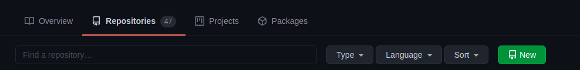
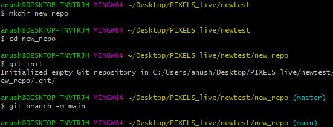
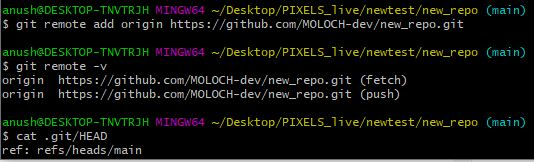

# Version control, Git and GitHub

* [Get familiar with version control, Git and GitHub](#get-familiar-with-version-control-git-and-github)
* [Create your own repository and project folder structure](#create-your-own-repository-and-project-folder-structure)
  * [Remote Initialisation](#remote-initialisation)
  * [Local Initialisation](#local-initialisation)
* [Sync and interact with your repository through the command line](#sync-and-interact-with-your-repository-through-the-command-line)

# Get familiar with version control, Git and GitHub

## What is version control?
* Version control allows you to keep track of your work and helps you to easily explore the changes you have made, be it data, coding scripts, notes, etc.
* With version control software such as Git, version control is much smoother and easier to implement. Using an online platform like Github to store your files means that you have an online back up of your work, which is beneficial for both you and your collaborator
* Having a GitHub repo makes it easy for you to keep track of collaborative and personal projects - all files necessary for certain analyses can be held together and people can add in their code, graphs, etc. as the projects develop. 

## How to get started (Download)
* ### For Windows
    * Download and install [Git](https://git-scm.com/downloads) for your operating system.

* ### For Linux
    ```
    $ sudo apt-get update
    $ sudo apt-get install git
    ```
## How does version control work?
### What is a repository?
* You can think of a repository (aka a repo) as a “main folder”, everything associated with a specific project should be kept in a repo for that project. Repos can have folders within them, or just be separate files.

* You will have a local copy (on your computer) and an online copy (on GitHub) of all the files in the repository.

### The workflow
#### The GitHub workflow can be summarised by the “commit-pull-push” mantra.

* Commit
    * Once you’ve saved your files, you need to commit them - this means the changes you have made to files in your repo will be saved as a version of the repo, and your changes are now ready to go up on GitHub (the online copy of the repository).
* Pull 
    * Now, before you send your changes to Github, you need to pull, i.e. make sure you are completely up to date with the latest version of the online version of the files - other people could have been working on them even if you haven’t. You should always pull before you start editing and before you push.
* Push
    * Once you are up to date, you can push your changes - at this point in time your local copy and the online copy of the files will be the same.


# Create your own repository and project folder structure

# Remote Initialisation

### 1. To make a repository, go to `Repositories/New repository` & Click on `New` button.


### 2. Let’s create a new public repository. You can call it whatever you like if the name is available also add a small description.


### 3. Click on Initialise repo with a README.md file, which contains information about the project. Choose a License also & Click on `Create Repository` button.


### 4. Here is how the repository should look:


# Local Initialisation

* You can create a git repository **from a local directory** as well. The repository running on your local computer will have all the properties of a git repository
* To do this, first create a new folder
```
    mkdir my_project
```

* Initialise directory as git

```
    git init
```

<p align="center">
  
</p>

* Your default branch may be 'master'. Set it as 'main'

```
    git branch -m main
```
<p align="center">
  
</p>


* Set remote. URL will be the HTTPS url of the repo you have created before in [remote-initialisation]

```
    git remote add origin URL
```
<p align="center">
  
</p>


* Now your local directory is a git repository. You can start making changes to it as follows : 

```
    touch new_file.txt
    git status
    git add .
    git commit
    git push -u -f origin main
    
```
<p align="center">
  
</p>


# Sync and interact with your repository through the command line:

### Run the following command in Terminal or cmd, change `<username>` with your own username:
```
$ git clone https://github.com/<username>/my-first-repo.git
```
