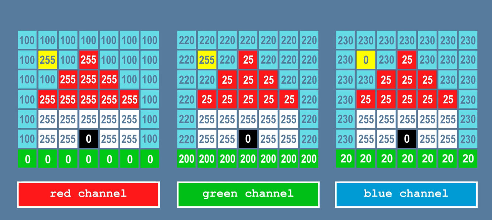


# IMAGE REPRESENTATION

## How do we represent Image?

- It can be represented in various forms. 
- As most of the time, representation

  refers to the way that brings information, such as color is coded digitally,

  and how the image is stored, i.e., how an image file is structured.

- So,for the simplicity of computing it is represented in a matrix form.

## SOME IMPORTANT TERMINOLOGIES

1. Pixel: Pixel is the smallest unit of a picture displayed on the computer screen.

A pixel includes its own:-

● Intensity

● Name or Address

The size of the image is defined as the total number of pixels in the horizontal direction times the total

number of pixels in the vertical direction. For eg: (512 x 512,640 x 480, or 1024 x 768).

## BINARY IMAGES

## GRAYSCALE IMAGES

## RGB IMAGES

2. **Resolution**: The number of pixels per unit is called the resolution

of the image.The sharpness of the picture on display depends on the

resolution and the size of the monitor.

It includes-

● **Image Resolution**: The distance between two pixels.

● **Screen Resolution**: The number of horizontal and vertical pixels displayed on the screen is called

Screen Resolution.

For Example– 640 x 480, 1024 x 768 (Horizontal x Vertical)

3. **Aspect Ratio**: The ratio of image’s width to its height is known as

the aspect ratio of an image. The height and width of an image are

measured in length or number of pixels.

For Example: If a graphics has an aspect ratio of 2:1, it means the width is twice large to height.

It includes–

● **Frame aspect ratio**: Horizontal /Vertical Size

● **Pixel aspect ratio**: Width of Pixel/Height of Pixel

## COLOUR MODELS

Color model is a 3D color coordinate system to produce all range of color through the primary color set.
Their types are:

### ADDITIVE MODEL

● It is also named as “RGB model.” RGB stands for Red, Green, Blue.

● The Additive color model uses a mixture of light to display colors.

● The perceived color depends on the transmission of light.

● It is used in digital media.For eg: Computer Monitor, Television etc.

### SUBTRACTIVE MODEL

● It is also named as “CMYK Model.” CMYK stands for Cyan, Magenta, Yellow, and Black.

● The Subtractive model uses a reflection of light to display the colors.

● The perceived color depends on the reflection of light.

● The CMYK model uses printing inks. For Example: Paint, Pigments, and color filter etc.

### HSV COLOUR MODEL

● These are schemes that describe the way colors combine to create the spectrum we see.

● Unlike RGB and CMYK, which use primary colors, HSV is closer to how humans perceive color.

● It has three components: hue, saturation, and value. This color space describes colors (hue or tint)

in terms of their shade (saturation or amount of gray) and their brightness value.

.PNG)

### THREE COMPONENTS

**HUE**: Hue is the color portion of the model, expressed as a number from 0 to 360 degrees:

Red falls between 0 and 60 degrees.

Yellow falls between 61 and 120 degrees.

Green falls between 121 and 180 degrees.

Cyan falls between 181 and 240 degrees.

Blue falls between 241 and 300 degrees.

Magenta falls between 301 and 360 degrees.

**SATURATION**: Saturation describes the amount of gray in a particular color, from 0 to 100 percent.

Reducing this component toward zero introduces more gray and produces a faded effect. Sometimes,

saturation appears as a range from 0 to 1, where 0 is gray, and 1 is a primary color.

**VALUE (OR BRIGHTNESS)**: Value works in conjunction with saturation and describes the brightness or

intensity of the color, from 0 to 100 percent, where 0 is completely black, and 100 is the brightest and

reveals the most color.

