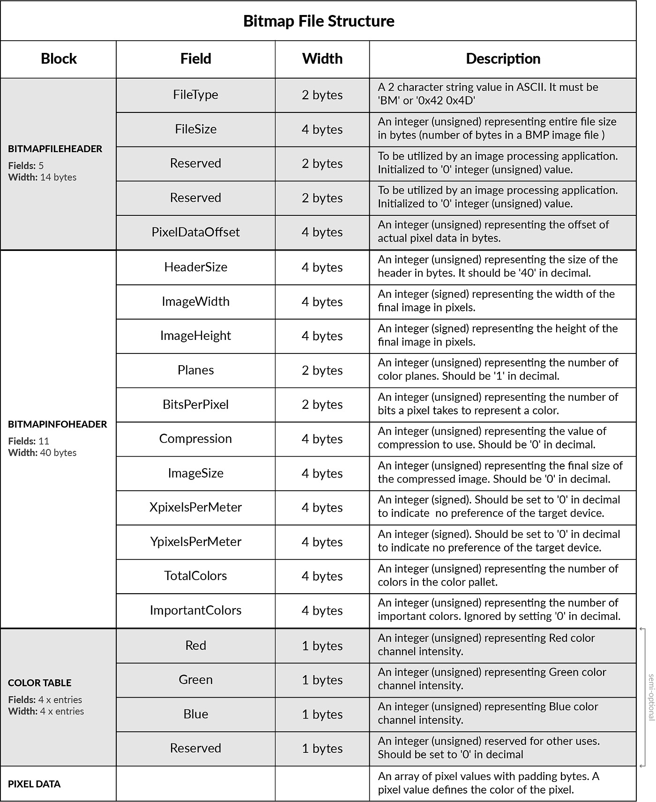

# Image Representation

## Table Of Contents
- [Image Representation](#image-representation)
  - [Table Of Contents](#table-of-contents)
  - [How Do We Represent Image?](#how-do-we-represent-image)
  - [Some Important Terminologies](#some-important-terminologies)
    - [Binary Images](#binary-images)
    - [Grayscale Images](#grayscale-images)
    - [RGB Images](#rgb-images)
  - [Colour Models](#colour-models)
    - [Additive Model](#additive-model)
    - [Subtractive Models](#subtractive-models)
    - [HSV Colour Model](#hsv-colour-model)
  - [Different Image Storing Formats](#different-image-storing-formats)
      - [BitMap (.bmp)](#bitmap-bmp)
      - [TIFF Format (.tiff , .tif)](#tiff-format-tiff--tif)
      - [JPG Format (.jpg , .jpeg , .jpe , .jif , .jfif)](#jpg-format-jpg--jpeg--jpe--jif--jfif)
      - [PNG Format (.png)](#png-format-png)
  - [How is image actually stored ?](#how-is-image-actually-stored-)
    - [Block 1: File Type Data](#block-1-file-type-data)
    - [Block 2: Image Information Data](#block-2-image-information-data)
    - [Block 3: Color Pallet (semi-optional)](#block-3-color-pallet-semi-optional)
    - [Block 4: Raw Pixel Data](#block-4-raw-pixel-data)
    - [Total BMP File Size](#total-bmp-file-size)
  - [Installations](#installations)
    - [Ubuntu](#ubuntu)
    - [MacOS](#macos)
  - [Build and run the executables](#build-and-run-the-executables)
      - [Run without make](#run-without-make)

## How Do We Represent Image?

- It can be represented in various forms. 
- As most of the time, representation

  refers to the way that brings information, such as color is coded digitally,

  and how the image is stored, i.e., how an image file is structured.

- So,for the simplicity of computing it is represented in a matrix form.


## Some Important Terminologies

1. Pixel: Pixel is the smallest unit of a picture displayed on the computer screen.

A pixel includes its own:-

● Intensity

● Name or Address

The size of the image is defined as the total number of pixels in the horizontal direction times the total

number of pixels in the vertical direction. For eg: (512 x 512,640 x 480, or 1024 x 768).

### Binary Images


### Grayscale Images


### RGB Images


2. **Resolution**: The number of pixels per unit is called the resolution

of the image.The sharpness of the picture on display depends on the

resolution and the size of the monitor.

It includes-

● **Image Resolution**: The distance between two pixels.

● **Screen Resolution**: The number of horizontal and vertical pixels displayed on the screen is called

Screen Resolution.

For Example– 640 x 480, 1024 x 768 (Horizontal x Vertical)


3. **Aspect Ratio**: The ratio of image’s width to its height is known as

the aspect ratio of an image. The height and width of an image are

measured in length or number of pixels.

For Example: If a graphics has an aspect ratio of 2:1, it means the width is twice large to height.

It includes–

● **Frame aspect ratio**: Horizontal /Vertical Size

● **Pixel aspect ratio**: Width of Pixel/Height of Pixel

## Colour Models

Color model is a 3D color coordinate system to produce all range of color through the primary color set.
Their types are:

### Additive Model

● It is also named as “RGB model.” RGB stands for Red, Green, Blue.

● The Additive color model uses a mixture of light to display colors.

● The perceived color depends on the transmission of light.

● It is used in digital media.For eg: Computer Monitor, Television etc.


### Subtractive Models

● It is also named as “CMYK Model.” CMYK stands for Cyan, Magenta, Yellow, and Black.

● The Subtractive model uses a reflection of light to display the colors.

● The perceived color depends on the reflection of light.

● The CMYK model uses printing inks. For Example: Paint, Pigments, and color filter etc.


### HSV Colour Model

● These are schemes that describe the way colors combine to create the spectrum we see.

● Unlike RGB and CMYK, which use primary colors, HSV is closer to how humans perceive color.

● It has three components: hue, saturation, and value. This color space describes colors (hue or tint)

in terms of their shade (saturation or amount of gray) and their brightness value.


Three Components of HSV colour model are as follows:

* **HUE**: Hue is the color portion of the model, expressed as a number from 0 to 360 degrees:
  * Red falls between 0 and 60 degrees.
  * Yellow falls between 61 and 120 degrees.
  * Green falls between 121 and 180 degrees.
  * Cyan falls between 181 and 240 degrees.
  * Blue falls between 241 and 300 degrees.
  * Magenta falls between 301 and 360 degrees.

* **SATURATION**: Saturation describes the amount of gray in a particular color, from 0 to 100 percent.
  * Reducing this component toward zero introduces more gray and produces a faded effect. Sometimes,
  * saturation appears as a range from 0 to 1, where 0 is gray, and 1 is a primary color.

* **VALUE (OR BRIGHTNESS)**: Value works in conjunction with saturation and describes the brightness or intensity of the color, from 0 to 100 percent, where 0 is completely black, and 100 is the brightest and reveals the most color.
   
* All images are stored in the computer as rectangular pixels. The resolution is an image referign to the number of pixels in a grid. Higher resolutions can be more details can be stored in an image. 
* Images are stored and transmitted using image file formats, which are digital file formats. Each file format has an own method for storing and compressing image data, which can affect how many pixels an image can have.

## Different Image Storing Formats

#### BitMap (.bmp)

* The BMP(Bitmap) format simply records the colour of each pixel with no compression(typically).
* It simply stores the image pixels by pixels.  This means that a BMP image file can contain a large number of pixels, but the file size will also be very large. For example, a 1920x1080 pixel BMP image can be over 6 MB in size.

#### TIFF Format (.tiff , .tif)

* A TIFF, which stands for Tag Image File Format, is a computer file used to store raster graphics and image information. A favourite among photographers, TIFFs are a handy way to store high-quality images before editing if you want to avoid lossy file formats. 

* TIFF files are a lossless form of file compression, which means they’re larger than most but don’t lose image quality.

#### JPG Format (.jpg , .jpeg , .jpe , .jif , .jfif)

* A JPG file is a raster image saved in the JPEG format, commonly used to store digital photographs and graphics created by image-editing software. JPEG features lossy compression that can significantly reduce the size of an image without much degradation and supports up to 16,777,216 colors.

* This means that a JPEG image file can contain a moderate number of pixels while still maintaining reasonable image quality. For example, a 1920x1080 pixel JPEG image can be under 1 MB in size.


#### PNG Format (.png)
* A PNG file is an image saved in the Portable Network Graphic (PNG) format, commonly used to store web graphics, digital photographs, and images with transparent backgrounds. It is a raster graphic similar to a .JPG image but is compressed with lossless compression and supports transparency.

* This means that a PNG image file can contain a moderate number of pixels while still maintaining high image quality. For example, a 1920x1080 pixel PNG image can be under 3 MB in size.

## How is image actually stored ?

To simplify how image is stored we will restrict ourselves to the following parameters: 
* Image is of the format `BitMap(BMP)`, since they do not contain any compressed data so there is no extra step required for decompression
* Image is grayscale.

Every file is made of binary numbers, whether that is an image file or a text file. These binary numbers represent the content of the file and a computer decodes that information in the CPU. A plain-text file contains only text (without any styling or file metadata). Each character of the text is represented by their code-point (a decimal number assigned to each character). So if view a plain-text file in a binary, all binary numbers represent characters only.

So every BMP image contains the following sections
1) File Type Data
2) Image Information Data
3) Color Pallet
4) Raw Pixel Data


### Block 1: File Type Data

This block is a BMP Header labeled as `BITMAPFILEHEADER`. This is the starting point of the BMP file and has 14 bytes width. This header contains a total of 5 fields of variable byte width. These are mentioned in the below table.

| Field Name | Size (in Bytes) | Description |
|----------|:-------------:|------------------------|
| FileType |  2 Bytes | A 2 character string value in ASCII to specify a DIB file type. It must be 'BM' or '0x42 0x4D' in hexadecimals for modern compatibility reasons. |
| FileSize | 4 Bytes | An integer (unsigned) representing entire file size in bytes. This value is basically the number of bytes in a BMP image file. |
| Reserved | 2 Bytes | These 2 bytes are reserved to be utilized by an image processing application to add additional meaningful information. It should be initialized to '0' integer (unsigned) value. |
| Reserved | 2 Bytes | Same as the above. |
| PixelDataOffset | 4 Bytes | An integer (unsigned) representing the offset of actual pixel data in bytes. In nutshell:- it is the number of bytes between start of the file (0) and the first byte of the pixel data. |
| Total | 14 Bytes | Size of the BITMAPFILEHEADER in bytes. |

### Block 2: Image Information Data

This is a DIB Header must be used to specify the color and image information. Unlike `BITMAPFILEHEADER`, there are many types of info headers (listed on the Wiki page). Each header has different byte-width but for compatibility reasons, we use BITMAPINFOHEADER.

| Field Name | Size (in Bytes) | Description |
|----------|:-------------:|------------------------|
| HeaderSize | 4 bytes | An integer (unsigned) representing the size of the header in bytes. It should be '40' in decimal to represent BITMAPINFOHEADER header type. |
| ImageWidth |	4 bytes | An integer (signed) representing the width of the final image in pixels.|
| ImageHeight | 4 bytes | An integer (signed) representing the height of the final image in pixels. |
| Planes | 2 bytes | An integer (unsigned) representing the number of color planes of the target device. Should be '1' in decimal. |
| BitsPerPixel | 2 bytes | An integer (unsigned) representing the number of bits (memory) a pixel takes (in pixel data) to represent a color. |
| Compression | 4 bytes | An integer (unsigned) representing the value of compression to use. Should be '0' in decimal to represent no-compression (identified by 'BI_RGB'). |
| ImageSize | 4 bytes | An integer (unsigned) representing the final size of the compressed image. Should be '0' in decimal when no compression algorithm is used. |
| XpixelsPerMeter | 4 bytes | An integer (signed) representing the horizontal resolution of the target device. This parameter will be adjusted by the image processing application but should be set to '0' in decimal to indicate no preference. |
| YpixelsPerMeter | 4 bytes | An integer (signed) representing the verical resolution of the target device (same as the above). |
| TotalColors | 4 bytes | An integer (unsigned) representing the number of colors in the color pallet (size of the color pallet or color table). If this is set to '0' in decimal :- 2^BitsPerPixel colors are used. |
| ImportantColors | 4 bytes | An integer (unsigned) representing the number of important colors. Generally ignored by setting '0' decimal value. |
| Total | 40 bytes | Size of the BITMAPINFOHEADER in bytes. |

### Block 3: Color Pallet (semi-optional)

This block contains the list of colors to be used by a pixel. This is an indexed table with the index starting from 0. The integer value of the pixel points to the color index in this table and that color is printed on the screen.

*However, this block is mandatory when BitsPerPixel is less than or equal to 8, hence this block is semi-optional.*

The below table contains information about the maximum possible colors for a given BitsPerPixel(bpp) or bit-depth.

| BitsPerPixel(bpp) | Palletized | Max Colors | Description |
|:----------:|:-------------:|:--------------:|:-------:|
|1 | Yes | 2 | Ideal for monochromatic image of any two colors defined in the pallet. |
| 4 | Yes | 16 | Maximum 16 distinct colors can be defined in the pallet. |
| 8 | Yes | 256 | Maximum 256 distinct colors can be defined in the pallet. |
| 16 | No | 65_536 | Color is derived from RGB value (5-bit color channel / MSB is ignored). |
| 24 | No | 16M (16_777_215) | Color is derived from RGB value (8-bit color channel). |
| 32 | No | 4B (4_294_967_296) | Color is derived from RGBA value (8-bit color channel and 8-bit alpha channel). |

### Block 4: Raw Pixel Data

This block contains binary numbers dedicated to representing the unique color values of each individual pixel. Depending on the bpp of the BMP image, a byte can contain color values of multiple pixels or multiple bytes can be used to represent the color value of a single pixel.

The size of this block, however, is not that straightforward to calculate. BMP scan lines need padding bytes and hence, we will be able to calculate size once we have written all the bytes.

### Total BMP File Size

The FileSize field in `BITMAPFILEHEADER` header is the sum of all the bytes in these 4 blocks. We could set the value of this field to 0 and it might work in all the BMP rendering applications but doing that should be avoided.



*Note: It is to be noted that this example uses SDL2 library just to fulfil the purpose of displaying each pixel of the image on the screen. As such there is no special need to understand the internals of SDL2 library to understand the basics of image representation.*

## Installations

To install sdl and its related libraries :

### Ubuntu

```sh 
sudo apt-get install libsdl2-2.0-0 
```

```sh 
sudo apt-get install libsdl2-image-dev 
```

### MacOS

```zsh
brew install sdl2
```

## Build and run the executables

Now that you are aware with the various image storing formats, let's look at how to create and execute executables.

After cloning in the Pixels_Seminar repository, get into the image_storing_formats folder using cd command 

`cd /Pixels_Seminar/Image_storing_formats`

image_storing_formats.cpp is our code file.

Perform make command 

`make`

To run 

- `./image <image_path>)`\
  for eg : `./image /home/chinmay/Pixels_Seminar/3_cv_basics/1_image_representation/image.bmp`

This will display the image.

#### Run without make
If you want to run the code without make then just type

- `g++ -g image_storing_formats.cpp -o output $(pkg-config --cflags --libs sdl2 SDL2_image)`

and then
- `./image <image_path>)`\
  for eg : `./image /home/chinmay/Pixels_Seminar/3_cv_basics/1_image_representation/image.bmp`
  
  
This will display the image.
