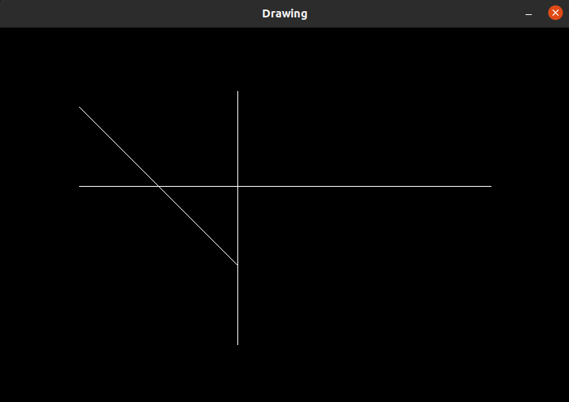

# DRAWING SHAPES ON IMAGES

There are many reasons for drawing shapes on images such as for selecting the Region of Interest in computer vision applications, for making annotations, etc. Such shapes can be drawn by using the OpenCV library functions as well.

The first step is to initialise a black image with all pixel values set to 0 and pre-set dimensions.

After that, a line is created using for loops.

*Drawing on a blank image*

