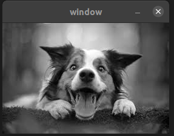
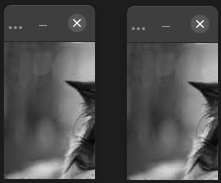
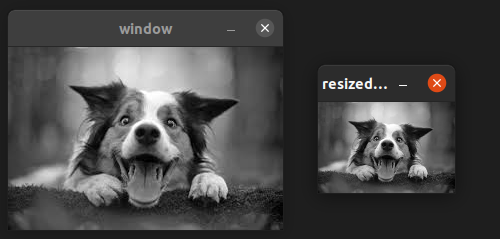

# CROPPING OF IMAGES

The most popular of all image processing applications is image cropping. OpenCV offers functionality to do the same.

### Steps:
1. Read an image from the directory and convert it to the Mat format.
2. Declare three more Mat objects.
3. Obtain the dimensions of the image using the *size()* function.
4. Resize the image using the *resize()* function which takes in the size of the final image as the last parameter. Since in the example, the final size is half the initial size, alternate rows of pixels would be removed.
5. To crop an image, we created another image and declaring with the original image with changed dimentions using the *Range()* function.
6. We created another image in which we crop it using the loop method by creating a image with cropped image dimantions and filling those under loop from original image.
7. Finally, we display all the images that we have created.

*This is the original image*

*This is the cropped image*

*This is resized image*

