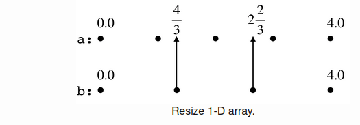

# Interpolation


## Table of contents
- [What is Interpolation ? ](#interpolation)
- [Interpolation Basics](#interpolationBasics)
  - [ Linear Interpolation ](#LI)
  - [Resizing a 1-Dimensional Array](#R)
  - [Mapping in 2-Dimensions](#Map)
- [Different Image Interpolation Techniques](#DIIT)
  - [1 : Nearest Neighbour](#NN)
  - [2 : Bilinear Interpolation](#BN)
- [Demo ](#Demo)


<a name="interpolation"></a>
## What is interpolation ?

**Interpolation** in images is a technique used to create new pixels in an image by estimating their values based on the available information from the existing pixels. It is commonly used when scaling images up or down .

**Image interpolation** tries to attain a best estimation of a pixel's intensity based on neighboring pixel values on proximity basis.

| Original Image | Scaled Image using Interpolation 
|-----|-----|
|||

<a name="interpolationBasics"></a>
## Interpolation Basics <a name="Interpolation-Basics"></a>
<a name="LI"></a>
### Linear Interpolation <a name="LI"></a>
We will first discuss Linear Interpolation which is more common and easier to understand.

Let’s say we have two points on a straight line with coordinate a
and b, and they are associated with values A and B. Now if we have a third point with coordinate x where a≤x≤b, how do we interpolate the values of cooridnates a and b at coordinate x?


where w=(x−a)/(b−a) .

The weight for A is proportional to x’s distance to b (rather than a), while the weight for B is proportional to its distnace to a (rather than b). When x moves to a, its value X becomes A; similarly, X becomes B when x moves to b.

Congratulations ! You have just understood linear interpolation , the first building block to interpolation .
<a name="R"></a>
### Resizing a 1-Dimensional Array 

Given that we know how to do interpolation between two points, let’s consider a more general scenario: we have a 1-D array a of size n (e.g n = 5 ), and we wish to stretch or shrink the array to a differet size m (e.g m = 4), where the values in the new array b is somehow computed from the original array in a linear fashion.



How do we get the values of array b? Well, it makes sense to let b[0] == a[0] and b[3] == a[4], because they have the same coordinates. For those points in the new array for which we don’t have corresponding points in the original array (i.e. b[1] and b[2]), we can map them to the original array where they will have fractionally-valued coordinates (4/3 and 8/3). Then b[4/3] and b[8/3] can be computed using the Linear Interpolation approach from a[1], a[2] and a[2], a[3] .

Now the question reduces to how do we map the coordinates from the new array b to the original array a. We notice that the mapping depends on the ratio of the length of “integer intervals” — in this case, it’s 4/3 (i.e. (n - 1)/(m - 1)). For element in array b with index i, its mapped coordinate in array a is ratio * i, and we compute the interpolation using the values of the two neighboring elements a[floor(ratio * i)] and a[ceil(ratio * i)].
<a name="Map"></a>
### Mapping in Two Dimensions 

For mapping in two dimensions , we simply extend from the 1-Dimensional Case for X and Y axes respectively 

Let the size of the original image be h*w and size of the new image be 
a * b .

We will define two ratios : 

**X_RATIO** = (w-1) / (b-1)

**Y_RATIO** = (h-1) / (a-1)


Let the (Px,Py) be the new coordinates in the resized image , then the corresponding old coordinates to which the new coordinates are mapped to become (Px\*X_RATIO,Py \*Y_RATIO)

<a name="DIIT"></a>
## Different Image Interpolation Techniques

<a name="NN"></a>
### 1 : Nearest Neighbour 

**Nearest neighbour interpolation** is a method used in image processing to resize images. When an image is resized using this method, the algorithm selects the pixel closest to the target location in the new image to determine its color value. Essentially, the algorithm looks at the nearest pixel to the original pixel and uses that value as the new pixel's color.


For Example , 
|Original Image|Scaled Image |DownScaled Image |
|--------|---------|----|
||| |


#### Image Quality using Nearest Neighbour 


While this method is simple and computationally efficient, it can produce images with a blocky or pixelated appearance when scaling up. This is because the algorithm simply duplicates each pixel from the original image to create the new pixels, without considering any other information from the surrounding pixels.

#### Applications 

Nearest neighbour interpolation is commonly used in applications where speed is a priority and where preserving the original pixel values is more important than achieving a smooth or detailed appearance. For example, it may be used in some types of video game graphics or where real-time processing is required. However, for applications where image quality is more important, more advanced interpolation methods such as bilinear or bicubic may be used
<a name="BN"></a>
### 2 : Bilinear Interpolation


**Bilinear interpolation** uses a weighted average of the four nearest pixels to the target location in the original image to determine the new pixel value. The algorithm calculates the color value for each new pixel by taking a weighted average of the color values of the four nearest pixels. The weights are determined by the distance between the target location and each of the four surrounding pixels.

This method is called "bilinear" because it uses linear interpolation in two directions, both horizontally and vertically. Essentially, the algorithm interpolates between the values of adjacent pixels in both the horizontal and vertical directions to create new pixel values that lie between the original pixels.


**Bilinear interpolation** produces smoother results than nearest neighbour interpolation, as it takes into account information from the surrounding pixels to estimate the new pixel values. However, it is still limited by the quality and resolution of the original image, and may not be sufficient for applications where high-quality and detailed images are required.

|Original Image|Scaled Image|DownScaled Image|
|--------|---------|----|
||| |

**Bilinear interpolation** is commonly used in image processing applications such as graphics rendering, computer vision, and medical imaging, where high-quality images are required, but computational efficiency is also important.


<a name="Demo"></a>
## Demo 

1. Move into the cv_basics directory from the root pixels directory by running following command :
```
    cd 4_cv_basics 
```
2. Move into the Interpolation directory from the cv_basics directory by running following command :
```
    cd 8_Interpolation 
```
3. Build the file by running the following command :
```
    make SRC=main.cpp link=interpolation.cpp
```
4. Finally execute the binary file created by running the following command :
```
    ./Interpolation
```


