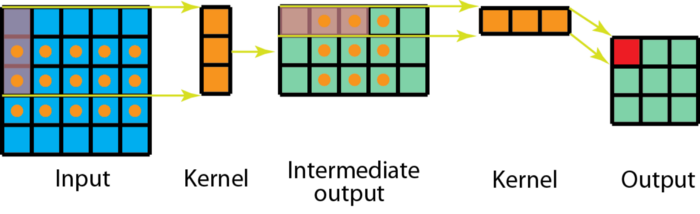

# Convolutions and Filtering

## Table of Contents

- [What are convolutions?](#what-are-convolutions)
- [What are kernels?](#what-are-kernels)
- [Different kernels and their effects](#different-kernels-and-their-effects)
  - [Simple box blur](#simple-box-blur)
  - [Edge detection operator](#edge-detection-operator)
  - [Sobel edge operators](#sobel-edge-operators)
  - [Sharpening operator](#sharpening-operator)
- [Separable convolutions](#separable-convolutions)
- [A suboptimal implementation](#a-suboptimal-implementation)
- [Resources you can visit](#resources-you-can-visit)

## What are convolutions?

A convolution is a fundamental mathematical operation commonly used in various
image processing tasks.  
Convolutions provide a way of 'multiplying' two arrays numbers together,
typically of different sizes. While convolutions are also used to process 1D
signals such as sound data, we will focus on the application of convolutions to
2D signals, i.e. images.  
They form the basis for implementing image processing operations where the
output pixel values are some **linear combination** of the corresponding input
pixel value and those that happen to surround it.

Mathematically, if $f$ and $g$ are discrete functions, then $f \ast g$ is the
product obtained by convolving them together, and is defined as follows:
$$(f \ast g)(x) = \sum_{u = -\infty}^\infty{f(u)g(x - u)}$$  
and if $f$ and $g$ are continuous functions, then $f \ast g$ is the
product obtained by convolving them together, and is defined as follows:
$$(f \ast g)(x) = \int_{-\infty}^\infty{f(u)g(x - u)} \cdot \mathrm{d}u$$  
In this notation, $f$ is known as the **kernel**, while $g$ is the actual input.
(Convolution is commutative, so the names can be swapped too)

`Note: In our use case, where we convolve an image having a finite number of discrete rows and columns, we just need to use the discrete form of the convolution operation.`

The convolution operation is better shown using an animation:


## What are kernels?

Kernels, also known as **filters**, are arrays of numbers (can be n dimensional i.e. 1D, 2D, 3D ...), which we often
refer to as **matrices**, with which we convolve input images to bring out
certain desired effects. Some such effects are blurring, sharpening, outlining,
embossing, edge detection, et cetera.

So, here
$$f(x) = \text{InputImage}, \\ g(x) = \text{Kernel}$$

Now, we can directly apply the kernels on the input image using convolution.
## Different kernels and their effects

Here are some examples of specific kernels and their effects on some example
input images:

### Simple box blur

_Example:_


_Matrix:_

```math
$$
\begin{bmatrix}
1 / 9 & 1 / 9 & 1 / 9 \\
1 / 9 & 1 / 9 & 1 / 9 \\
1 / 9 & 1 / 9 & 1 / 9
\end{bmatrix}
$$
```

Blur operations like this have the effect of averaging nearby pixels.  
This simple blur corresponds to a simple **average**, whereas others (like the
Gaussian blur we will see later) are a weighted average.  
A common theme with blurs is that their entries sum to 1, such that the total
luminance of the image is preserved.

### Edge detection operator

_Example:_


_Matrix:_

```math
$$
\begin{bmatrix}
-1 & -1 & -1 \\
-1 & +8 & -1 \\
-1 & -1 & -1
\end{bmatrix}
$$
```

This also works as a high pass filter.

### Sobel edge operators

_Example:_


_Matrices (horizontal and vertical):_

```math
$$
\begin{bmatrix}
-1 & -2 & -1 \\
 0 &  0 &  0 \\
+1 & +2 & +1
\end{bmatrix}
\hskip{10px}
\begin{bmatrix}
-1 &  0 & +1 \\
-2 &  0 & +2 \\
-1 &  0 & +1
\end{bmatrix}
$$
```

### Sharpening operator

_Example:_


_Matrix:_

```math
$$
\begin{bmatrix}
0 & -0.5 & 0 \\
-0.5 & +3 & -0.5 \\
0 & -0.5 & 0
\end{bmatrix}
$$
```

## Separable convolutions

To compute the value of one output pixel after a 2D convolution using a
$m \times n$ kernel, we need to do $m \cdot n$ multiplications. This can make 2D
convolution a very expensive operation! Thankfully, in certain cases, the
computation can be reduced to $m + n$ multiplications. Kernels for which this is
possible are called 'separable'. Here is how it works: The $m \times n$ matrix
is decomposed by writing it as a product of a $m \times 1$ matrix and a
$1 \times n$ matrix. Convolving the input with each of these takes $m$ and $n$
multiplications per pixel respectively, reducing the total to $m + n$.

```math
$$
\begin{bmatrix}
A \cdot a & A \cdot b & A \cdot c \\
B \cdot a & B \cdot b & B \cdot c \\
C \cdot a & C \cdot b & C \cdot c
\end{bmatrix} = \begin{bmatrix}A \\ B \\ C\end{bmatrix} \begin{bmatrix}a & b & c\end{bmatrix}
$$
```

The Gaussian kernel is a well-known example of a separable kernel:

```math
$$
\begin{bmatrix}
1 / 16 & 2 / 16 & 1 / 16 \\
2 / 16 & 4 / 16 & 2 / 16 \\
1 / 16 & 2 / 16 & 1 / 16
\end{bmatrix} = \begin{bmatrix}1 / 4 \\ 1 / 2 \\ 1 / 4\end{bmatrix} \begin{bmatrix}1 / 4 & 1 / 2 & 1 / 4\end{bmatrix}
$$
```



It is worth noting that the convolution operation is associative, so either of
the simpler convolutions can be applied first.

```math
$$
\text{input} \ast \begin{bmatrix}
A \cdot a & A \cdot b & A \cdot c \\
B \cdot a & B \cdot b & B \cdot c \\
C \cdot a & C \cdot b & C \cdot c
\end{bmatrix} = \text{input} \ast \Bigg(\begin{bmatrix}A \\ B \\ C\end{bmatrix} \begin{bmatrix}a & b & c\end{bmatrix}\Bigg) = \Bigg(\text{input} \ast \begin{bmatrix}A \\ B \\ C\end{bmatrix}\Bigg) \ast \begin{bmatrix}a & b & c\end{bmatrix}
$$
```

## A suboptimal implementation

We have spun up a suboptimal implementation of the convolution operation for
demonstration purposes.  
To build and run it, execute the following commands from the root of this
repository.

```bash
cd 4_cv_basics/4_convolutions_filtering      # Enter the project directory
make SRC=main.cpp link=src/convolution.cpp   # Use make to build the project
./Convolution_Filtering                      # Execute the built project
```

The demo code is purposefully kept in an unoptimized state, your task is to
understand it and then improve it based on your understanding.  
Feel free to make any changes you deem useful.

Some points to be considered while thinking about optimizations are:

- Will it work for kernels having different sizes?
- Can it handle images having different number of channels?
- Can you improve space complexity of above implementation?

Above points are given only for the purpose of giving a rough idea about
possible optimizations and are not necessarily sufficient.

## Resources you can visit
- [Build your Intuition about Convolution](https://youtu.be/KuXjwB4LzSA) :)
- [Interactive demo](https://setosa.io/ev/image-kernels/) 
