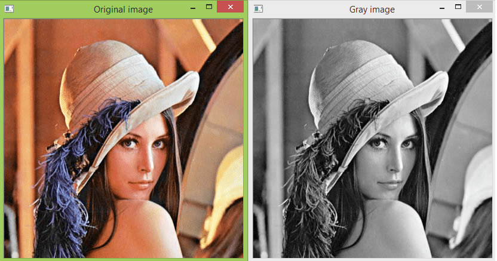

## Grayscale

A grayscale image is a type of image that only contains shades of gray, ranging from black (zero intensity) to white (maximum intensity), with no color information. It is a commonly used image representation in computer vision, image processing, and other related fields. Converting a color image to grayscale is a process of removing the color information and keeping only the brightness information of the image.

In OpenCV, the `cvtColor` function is used to convert an image from one color space to another. To convert an image to grayscale, we need to use the `COLOR_BGR2GRAY` flag as the second argument of cvtColor function. This flag specifies that we want to convert the image from the `BGR` color space (used by default in OpenCV) to grayscale.

The `cvtColor` function takes the input image and creates a new image with the same size and depth, but with only one channel (grayscale). The algorithm for converting color to grayscale varies depending on the application, but a common approach is to calculate the luminance (brightness) of each pixel using the following formula:

$Luminance = 0.299 * R + 0.587 * G + 0.114 * B$

Where $R$, $G$ and $B$ are the red, green, and blue color channels of the pixel. The coefficients $0.299$, $0.587$ and $0.114$ are chosen to reflect the sensitivity of the human eye to different colors. This formula is applied to each pixel of the input image to produce the corresponding pixel value in the output grayscale image.

#### Illustration

