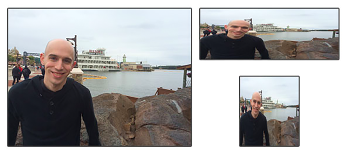

## Resizing

Image resizing refers to the scaling of images. Scaling comes in handy in many image processing as well as machine learning applications. It helps in reducing the number of pixels from an image and that has several advantages e.g. It can reduce the time of training of a neural network as the more the number of pixels in an image more is the number of input nodes that in turn increases the complexity of the model.

It also helps in zooming in on images. Many times we need to resize the image i.e. either shrink it or scale it up to meet the size requirements. OpenCV provides us several interpolation methods for resizing an image.

Choice of Interpolation Method for Resizing:

1. <b>INTER_AREA</b>: This is used when we need to shrink an image.
2. <b>INTER_CUBIC</b>: This is slow but more efficient.
3. <b>INTER_LINEAR</b>: This is primarily used when zooming is required. This is the default interpolation technique in OpenCV.

### Illustration

