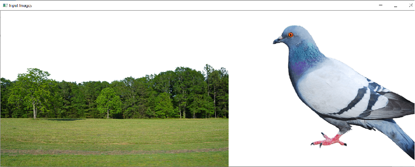

## Blending

This is also image addition, but different weights are given to images in order to give a feeling of blending or transparency. Images are added as per the equation below:

$g(x)=(1−α)(f_0(x)) +αf1(x)$

By varying $α$ from $0→1$, you can perform a cool transition between one image to another.

Here two images are taken to blend together. The first image is given a weight of 0.7 and the second image is given 0.3. `cv.addWeighted()` applies the following equation to the image:

$dst=α⋅img1+β⋅img2+γ$

Here $γ$ is taken as zero.

The $\gamma$ parameter in blending of images refers to the gamma correction applied to the images before blending. Gamma correction is a nonlinear operation that adjusts the brightness levels of an image. It is used to compensate for the nonlinear response of the human eye to changes in brightness.

The $\gamma$ parameter in the addWeighted function controls the gamma correction applied to the source images before blending. It is specified as a floating-point value, where a value of 1.0 means no gamma correction is applied, and values <b>less</b> than 1.0 <b>darken</b> the image, while values <b>greater</b> than 1.0 <b>brighten</b> the image.

**Note** : Image combination is a subset of Image Blending. In image blending we can specify the amount/percentage of effect that we want form either of the input images.

### Illustrations

### Expected Results

<!-- Masking -->
<table>
<tr>
<th colspan="2" style="text-align:center"> BLENDING </th>
</tr>
<tr>
<th style="text-align:center"> Image1</th>
<th style="text-align:center"> Image2 </th>
</tr>
<tr>
<td><image src="../assets/images/blending_image_1.png" alt = "Image1" width = 350 height="200"></td>
<td><image src="../assets/images/blending_image_2.png" alt = "Image1" width = 350 height="200"></td>
</tr>

<tr>
<th style="text-align:center" colspan="2"> Display Image</th>
</tr>
<tr>
<td style="text-align: center" colspan="2"><image src="../assets/images/blending_res.png" alt = "Image1" width = 350 height="200"></td>
