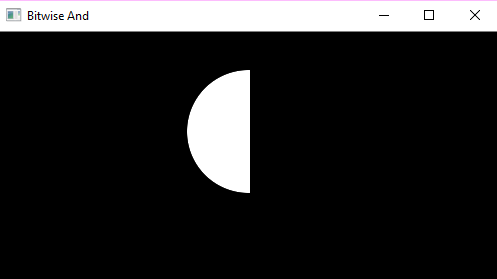
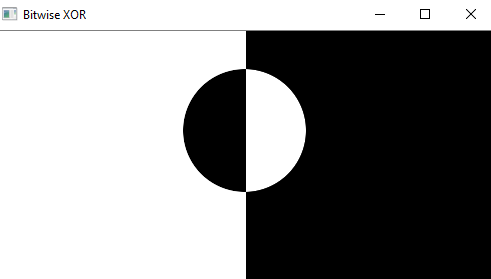

## Masking

1. Masking is an image processing method in which we define a small 'image piece' and use it to modify a larger image.
2. When talking about editing and processing images the term 'masking' refers to the practice of using a mask to protect a specific area of an image, just as you would use masking tape when painting your house.
3. Masking an area of an image protects that area from being altered by changes made to the rest of the image.
4. Masking is the process that is underneath many types of image processing, including edge detection, motion detection, and noise reduction
5. Usually binary masks are used (BLACK and WHITE)
6. Generally, BLACK portions are those which are undesired and want to be removed/ masked off
7. Generally, WHITE portions are those which are desired and want to be retained in the original image

#### Illustrations

#### Input Images

#### Bitwise AND

#### Bitwise OR

#### Bitwise XOR

#### Bitwise NOT

1. Image1 - Bitwise NOT/inversion of Input Image 1
2. Image2 - Bitwise NOT/inversion of Input Image 2

 

### Expected Results

<table>
<tr>
<th colspan="2" style="text-align:center"> MASKING </th>
</tr>
<tr>
<th style="text-align:center"> Image1</th>
<th style="text-align:center"> Image2 </th>
</tr>
<tr>
<td><image src="../assets/images/Image1.png" alt = "Image1" width = 350 height="200"></td>
<td><image src="../assets/images/Image2.png" alt = "Image1" width = 350 height="200"></td>
</tr>

<tr>
<th style="text-align:center"> ROI</th>
<th style="text-align:center"> Gray </th>
</tr>
<tr>
<td><image src="../assets/images/roi.png" alt = "Image1" width = 350 height="200"></td>
<td><image src="../assets/images/gray.png" alt = "Image1" width = 350 height="200"></td>

<tr>
<th style="text-align:center"> Mask</th>
<th style="text-align:center"> Mask_Inv </th>
</tr>
<tr>
<td><image src="../assets/images/mask.png" alt = "Image1" width = 350 height="200"></td>
<td><image src="../assets/images/mask_inv.png" alt = "Image1" width = 350 height="200"></td>
</tr>

<tr>
<th style="text-align:center"> BG</th>
<th style="text-align:center"> FG </th>
</tr>
<tr>
<td><image src="../assets/images/bg.png" alt = "Image1" width = 350 height="200"></td>
<td><image src="../assets/images/fg.png" alt = "Image1" width = 350 height="200"></td>
</tr>

<tr>
<th colspan="2" style="text-align:center"> dst</th>
</tr>
<tr>
<td colspan="2" style="text-align: center"><image src="../assets/images/dst.png" alt = "Image1" width = 350 height="200"></td>
</tr>
</table>
