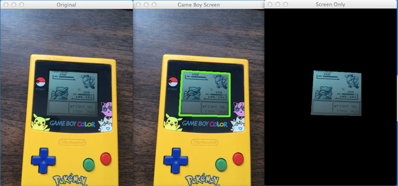

## Contours

Contours can be explained simply as a curve joining all the continuous points (along the boundary), having same color or intensity. The contours are a useful tool for shape analysis and object detection and recognition.

Illustration:

### What are Contours

When we join all the points on the boundary of an object, we get a contour. Typically, a specific contour refers to boundary pixels that have the same color and intensity. OpenCV makes it really easy to find and draw contours in images. It provides two simple functions:

    findContours()
    drawContours()

Also, it has two different algorithms for contour detection:

    CHAIN_APPROX_SIMPLE
    CHAIN_APPROX_NONE

### Steps for Detecting and Drawing Contours in OpenCV

OpenCV makes this a fairly simple task. Just follow these steps:

1. **Read the Image and convert it to Grayscale Format**

   Read the image and convert the image to grayscale format. Converting the image to grayscale is very important as it prepares the image for the next step. Converting the image to a single channel grayscale image is important for thresholding, which in turn is necessary for the contour detection algorithm to work properly.

2. **Apply Cannny Edge Detection**

   While finding contours, first always apply binary thresholding or Canny edge detection to the grayscale image. Here, we will apply Canny Edge Detection.

3. **Find the Contours**

   Use the findContours() function to detect the contours in the image.

4. **Draw Contours on the Original RGB Image**

   Once contours have been identified, use the drawContours() function to overlay the contours on the original RGB image.

### Expected Results

<table>
<tr>
<th colspan="2" style="text-align:center"> CONTOURS </th>
</tr>
<tr>
<th style="text-align:center"> Gray</th>
<th style="text-align:center"> Edges </th>
</tr>
<tr>
<td><image src="../assets/images/gray_player.png" alt = "Image1" width = 350 height="200"></td>
<td><image src="../assets/images/edges.png" alt = "Image1" width = 350 height="200"></td>
</tr>

<tr>
<th style="text-align:center" colspan="2"> Contours</th>
</tr>
<tr>
<td style="text-align: center" colspan="2"><image src="../assets/images/contours.png" alt = "Image1" width = 350 height="200"></td>
</table>

<table>
<tr>
