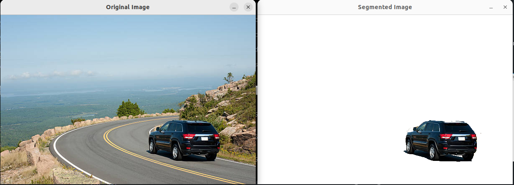
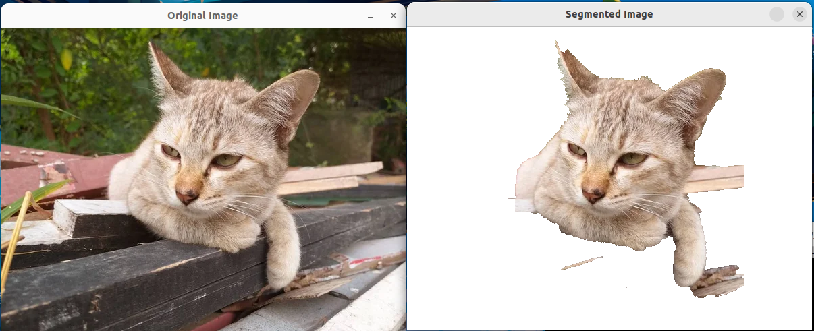
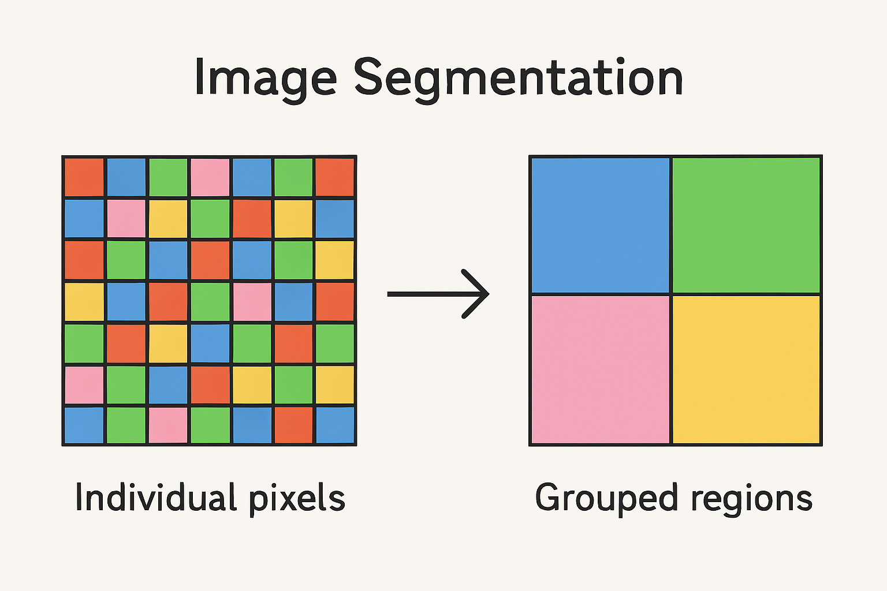
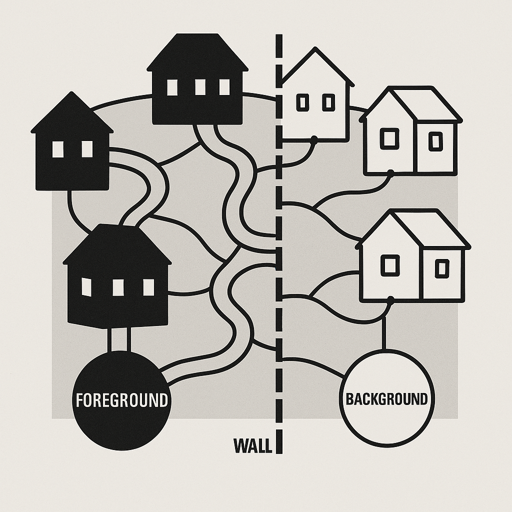
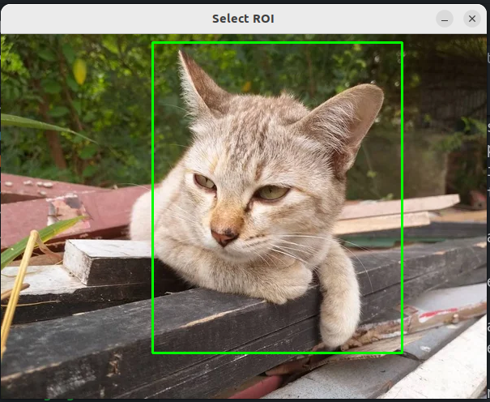
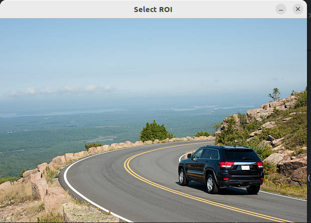
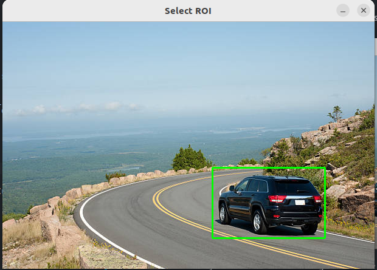
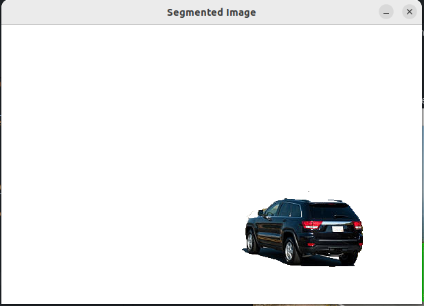

# Image Segmentation using GrabCut Algorithm

## Table of Contents

1. [Introduction](#introduction)
2. [Basics of Image Segmentation](#basics-of-image-segmentation)
3. [Graph Cuts in Image Segmentation](#graph-cuts-in-image-segmentation)
4. [How GraphCut Works](#how-graphcut-works)
5. [Additional Information](#additional-information)
6. [Further Learning Resources](#further-learning-resources)
7. [How to Use This Project](#how-to-use-this-project)

# Image Segmentation
## Introduction

Image segmentation allows devices to identify individual items in images. Consequently, apps can change backgrounds or erase subjects because of this capability. This process in a computer allows machines to isolate different elements that exist in an image.

When people look at photos, they automatically segment people, objects, and backgrounds without even realizing it. Brains automatically detect edges between objects. Image segmentation allows computers to do the same so that they can segment couches from cats, people from sunsets, or tables from apples.




## Basics of Image Segmentation

Glancing at a family photograph, the human vision instinctively recognizes individual family members, furniture pieces, pets, and other things in the photograph. The human vision recognizes those things naturally.

Computers view images differently. An image is just a collection of colored pixels to a computer. Image segmentation assists computers in making sense of these pixels by grouping them into significant areas. The process is like viewing a mosaic at different distances. Close up, only single pieces of the mosaic are observed. Middle distance, there are patterns. Distant, the whole picture is visible. Segmentation allows computers to view the big picture rather than single pixels.

Mathematically, image segmentation is a partition problem. Given an image represented as a function $I(x,y)$ that maps pixel coordinates to intensity or color values, segmentation divides the image domain into $n$ distinct regions $\{S_1, S_2, ..., S_n\}$ such that:

1. $\bigcup_{i=1}^{n} S_i = I$ (complete coverage)
2. $S_i \cap S_j = \emptyset$ for all $i \neq j$ (non-overlapping regions)
3. Each $S_i$ is connected
4. Pixels within each $S_i$ satisfy a predefined homogeneity criterion

The homogeneity criterion can be based on various features:
- Intensity: Using thresholding with a threshold $T$:
  ```math
  S(x,y) = \begin{cases}
  1, & \text{if } I(x,y) \geq T \\
  0, & \text{if } I(x,y) < T
  \end{cases}
  ```
- Color: Using color similarity metrics
- Texture: Using local pattern analysis
- Higher-level semantic information

Simple segmentation merely clumps pixels of the same color (like blue pixels that may be defining sky). More advanced techniques detect abrupt color transitions that define edges (like the edge of a person). The most advanced techniques identify objects by shape and context.



## Graph Cuts in Image Segmentation



Graph cuts are a powerful image segmentation tool. Although the term is technical, the idea is simple.

A picture can be imagined as a neighborhood where there is a house for every pixel. Every house shares a common border with its neighboring houses (neighbor pixels). There are two community centers for the neighborhood - one for "foreground" people and another one for "background" people.

Mathematically, an image is represented as a weighted graph $G = (V, E)$ where:
- Vertices $V$ correspond to pixels or superpixels
- Edges $E$ connect neighboring elements
- Edge weights $w(u,v)$ represent the dissimilarity between vertices

For pixels $p$ and $q$, a common weight function is:
```math
w(p,q) = e^{-\frac{||I(p) - I(q)||^2}{2\sigma^2}}
```

Where $\sigma$ controls the influence of intensity differences.

Each home has paths to both centers. More substantial paths are for stronger connections. More vibrant red houses may have stronger connections to the "foreground" center when trying to find a red apple in a picture.

The task is to determine where to place a wall in this neighborhood, splitting the two populations in front and rear. The objective is to not cut across main thoroughfares as much as possible. This wall is the border of the object and the background.

This approach has the following advantages:
- Examines the entire image as a whole rather than individual pixels
- Both pixel characteristics and neighboring pixel interactions are evaluated 
- Allows people to contribute, such as labelling some areas as foreground.

## How GrabCut Works
GrabCut is an easy-to-use separator for image parts. Here's how it functions:

- Rectangle Selection: Users put a rectangle over the subject to be separated. The rectangle says "the subject is somewhere in this area." Everything outside of this rectangle automatically becomes the background.
- Color Analysis: The system processes color patterns in both possible foreground (within the rectangle) and certain background (beyond the rectangle). For instance, while choosing a golden retriever, the system can determine tan/gold colors as possible foreground and green grass colors as background.

Mathematically, GrabCut models pixel color distributions using Gaussian Mixture Models (GMMs):
```math
P(z|\alpha,k,\theta,z) = \sum_{k=1}^{K} \pi_k \mathcal{N}(z|\mu_k,\Sigma_k)
```

Where:
- $\pi_k$, $\mu_k$, and $\Sigma_k$ are the weight, mean, and covariance of the $k$-th Gaussian component
- $K$ is typically 5 for both foreground and background models

- Building a Connection Network: The system constructs a network of relationships between all the pixels with foreground or background probability based on color. Visually similar pixels link to one another.
- Boundary Determination: It determines the most natural boundary line between the foreground and background. It detects the shortest path in the image that separates the object from the surrounding objects.
- Iterative Refinement: Once estimated, the system improves its knowledge of foreground and background colors, and then recalculates. The process is repeated a number of times until generating optimal results.

The energy function combines color models with smoothness constraints:
```math
E(\alpha,k,\theta,z) = U(\alpha,k,\theta,z) + V(\alpha)
```

Where:
- $U$ is the data term based on color models
- $V$ enforces spatial coherence:
  ```math
  V(\alpha) = \gamma \sum_{(p,q) \in E} \exp\left(-\beta||z_p - z_q||^2\right) \cdot \delta(\alpha_p \neq \alpha_q)
  ```

GrabCut allows users to intervene when errors occur. If an area of the subject is not chosen, users can mark that region as clear foreground. Similarly, regions of the background that were incorrectly added can be designated as clear background. This combines human decisions with computer processing.



GrabCut has other functionality:
- **Definite Region Marking**: Mark regions as "definitely foreground" or "definitely background."
- **Multi-Object Processing**: Process multiple objects simultaneously for group images.
- **Texture Recognition**: Consider textures for identifying visually similar objects with different patterns.
- **Video Processing**: Extend to video applications, following subjects between frames.
- **Multi-level Processing**: Process at various levels of detail for general shape and detailed features.

## Additional Information

### GrabCut Function Parameters
The `cv::grabCut` function implements the GrabCut image segmentation algorithm with the following parameters:
- `img`: Input 8-bit 3-channel image.
- `mask`: Input/output 8-bit single-channel mask initialized by the function.
- `rect`: ROI containing a segmented object, used when mode is `GC_INIT_WITH_RECT`.
- `bgdModel` and `fgdModel`: Temporary arrays for the background and foreground models.
- `iterCount`: Number of iterations for the algorithm.
- `mode`: Operation mode, one of the `GrabCutModes`.


## Further Learning Resources

To deepen your understanding of image segmentation beyond GrabCut, consider exploring:

1. **Watershed Algorithm**: A region-based approach that treats an image as a topographic surface
2. **Mean Shift Segmentation**: A feature-space analysis technique for locating maxima of a density function
3. **K-means Clustering**: A simple but effective method for partitioning pixels into k clusters
4. **Deep Learning Approaches**: Neural network architectures like U-Net or Mask R-CNN that have revolutionized semantic segmentation

For practical implementation, the OpenCV library provides implementations of many segmentation algorithms:

- `cv::watershed()` for watershed segmentation
- `cv::pyrMeanShiftFiltering()` for mean shift segmentation
- K-means clustering can be implemented using `cv::kmeans()`

Each approach has its strengths and weaknesses, making them suitable for different applications and image types. By understanding the theoretical foundations and practical implementations of these techniques, you'll be well-equipped to tackle a wide range of image segmentation challenges.
## How to Use This Project

### Prerequisites
- OpenCV 4.x installed
- C++ compiler (g++)
- Make build system

### Running Instructions

1. **Clone the Repository** (if you haven't already)
   ```bash
   git clone https://github.com/SRA-VJTI/Pixels_Seminar.git
   cd 4_cv_basics/9_image_segmentation
   ```

2. **Build the Program**
   ```bash
   make build
   ```

3. **Run the Program**
   ```bash
   ./image_segmentation
   ```

4. **Using the Program**
   - After you run the program, a window will open showing the default image (`car.jpeg`)

   - Use your mouse to draw a rectangle around the object you want to segment:
     - Left-click and hold to start drawing
     - Drag to create the rectangle
     - Release to finish drawing and press enter


   - The program will automatically apply the GrabCut algorithm
   - Results will be displayed in a new window

   - Press any key to exit

5. **Clean Build Files** (optional)
   ```bash
   make clean
   ```

### Troubleshooting
- If the program fails to start, ensure all the prerequisites mentioned earlier are properly installed
- If the segmentation results are not satisfactory, try:
  - Drawing a tighter rectangle around the object
  - Ensuring the object has good contrast with the background
  - Using an image with clear foreground/background separation

