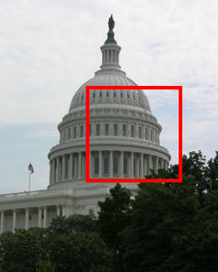
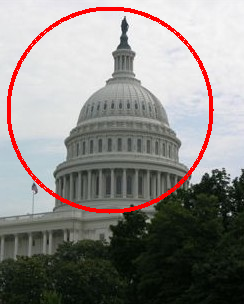
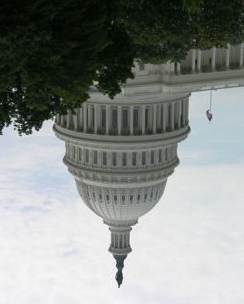
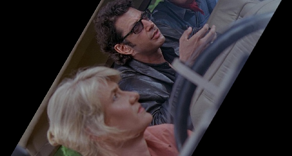
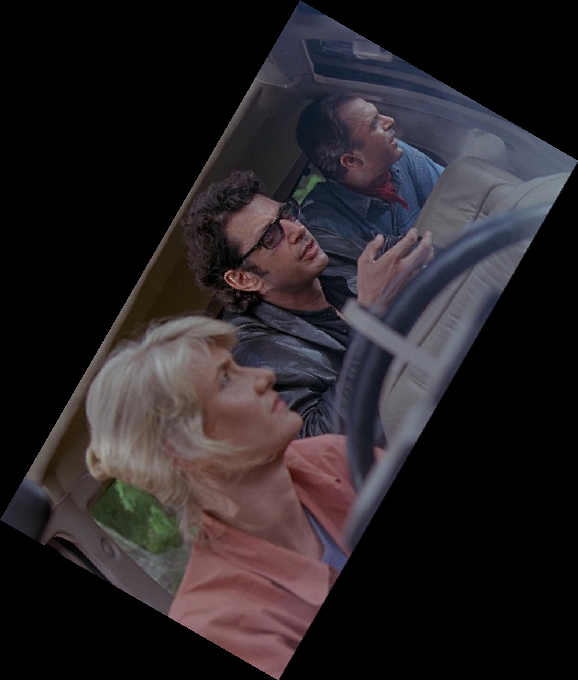

# **Playing with Images Assignment** *(without using OpenCV)*

## Tasks

- [Draw a filled rectangle](#draw-a-filled-rectangle)
- [Draw a filled-circle](#draw-a-filled-circle)
- [Draw a hollow rectangle](#draw-a-hollow-rectangle)
- [Draw a hollow circle](#draw-a-hollow-circle)
- [Rotating an image by 180 degrees](#rotating-an-image-by-180-degrees)
- [Bonus Task](#bonus-task)


## Draw a filled rectangle
In this task we will have to take the length, breath of the rectangle and coordinates of the top left pixel of the rectangle as an input from the user. A filled rectangle of the given coordinates and dimensions should be created in the image.
|  |  |
|:----:|:----:|
|**INPUT IMAGE** | **OUTPUT IMAGE**|
|||

## Draw a filled-circle
 In this task we will have to take the radius and coordinates of the center of the circle as an input from the user. A filled circle of the given coordinates and dimensions should be created in the image.
|  |  |
|:----:|:----:|
|**INPUT IMAGE** | **OUTPUT IMAGE**|
|||

## Draw a hollow rectangle
 In this Sub-task we will have to take the length, breadth, thickness of the border of the square and coordinates of the top left pixel of the square as an input from the user. A hollow square of the given coordinates and dimensions should be created in the image.
|  |  |
|:----:|:----:|
|**INPUT IMAGE** | **OUTPUT IMAGE**|
|||

## Draw a hollow circle
 In this task we will have to take the radius and coordinates of the center of the circle and also the thickness of the border as an input from the user. A hollow circle of the given coordinates and dimensions should be created in the image.
|  |  |
|:----:|:----:|
|**INPUT IMAGE** | **OUTPUT IMAGE**|
|||

## Rotating an image by 180 degrees
 In this task you will have to Rotate the given image by 180 degrees.
```Note : You cannot use the method we used in the demo```
|  |  |
|:----:|:----:|
|**INPUT IMAGE** | **OUTPUT IMAGE**|
|||

## Bonus Task

Write the code to rotate the given image by any arbitary angle, as can be seen in the example below. try both bound and non-bound. 
``` Do not use any inbuilt function for this task, except for reading and displaying images.```
  
**OUTPUT**
|||
|:---:|:---:|
|No Bound|Bound|