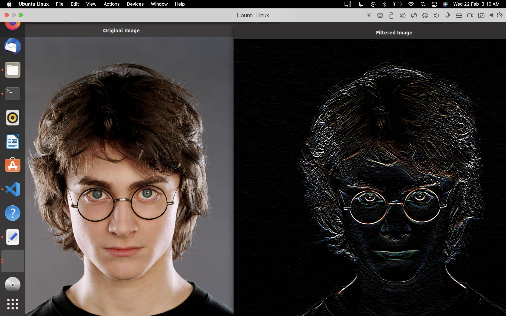
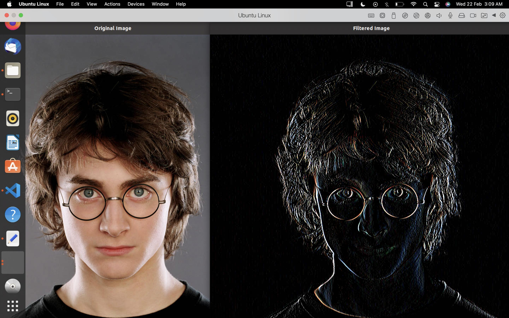
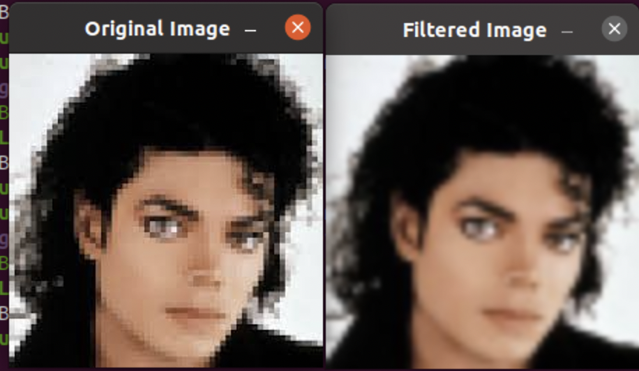
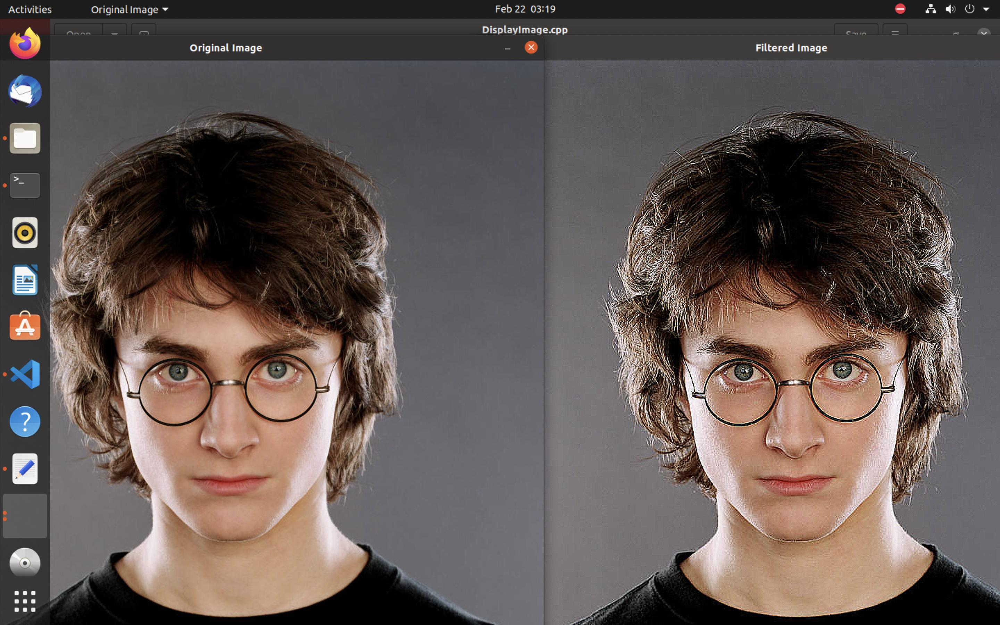

# Convolution Assignments

## Tasks

- [Sobel Edge Detection in X](#sobel-edge-detection-in-x)
- [Sobel Edge Detection in Y](#sobel-edge-detection-in-y)
- [Gaussian Smoothning](#gaussian-smoothning)
- [Sharpening](#sharpening)
- [Canny Edge Detection](#canny-edge-detection)

---

## Sobel Edge Detection in X:
   - **Description**:
       - Implement Sobel edge detection with Sobel kernels in horizontal direction.
   - **Input**: 
       - Path of image to be filtered.
   - **Expected Output**: 
       - Two windows depicting difference between original and filtered image.
       - Example : 

## Sobel Edge Detection in Y:
   - **Description**:
       - Implement Sobel edge detection with Sobel kernels in vertical direction.
   - **Input**: 
       - Path of image to be filtered.
   - **Expected Output**: 
       - Two windows depicting difference between original and filtered image.
       - Example :

## Gaussian Smoothning:
   - **Description**:
       - Apply Gaussian smoothing using normal 2D convolution.
   - **Input**: 
       - Path of image to be filtered.
   - **Expected Output**: 
       - Two windows depicting difference between original and filtered image.
       - Example :

## Sharpening:
   - **Description**:
       - Sharpen an image using filter2D method using an appropiate kernel.
   - **Input**: 
       - Path of image to be filtered.
   - **Expected Output**: 
       - Two windows depicting difference between original and filtered image.
       - Example :

## Canny Edge Detection:
   - **Description**:
       - Implement a Canny Edge detection using appropriate kenrel with out using any prebuilt functions.
   - **Input**: 
       - Path of image to be filtered.

