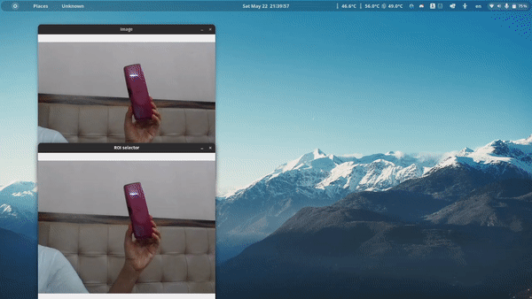

# Introduction to Computer Vision
This repository includes basics to :
1. Python 
2. Numpy: A python library 
3. Git 
4. Computer Vision.   
### The aim of this repository is to provide:  
- A brief idea of algorithms involved in Computer Vision . 
- Introduction to Version Control System: Git and GitHub. 
- Computer Vision and Image Processing basics, idea of implementation of various algorithms involved using numpy (instead of any dedicated image processing library like OpenCV.)
- Introduction to a commonly used Image Processing Library: <i>OpenCV</i>

## Demonstration 

## Table Of Contents
- [Table Of Contents](#table-of-contents)
- [Python](1_python_numpy_basics/README.md)
    * [Basics Of Python](/1_python_numpy_basics/1_python_basics.ipynb)
    * [Operators And Control Statements](/1_python_numpy_basics/2_operators_and_conrol_statements.ipynb)
    * [Lists In Python](/1_python_numpy_basics/3_lists.ipynb)
    * [Dictionaries In Python](/1_python_numpy_basics/4_dictionary.ipynb)
    * [Sets And Tuples](/1_python_numpy_basics/5_sets_and_tuples.ipynb)
    * [Functions](/1_python_numpy_basics/6_functions.ipynb)
    * [Classes And Objects](/1_python_numpy_basics/7_classes_and_objects.ipynb)
    * [Numpy Part-1](/1_python_numpy_basics/8_numpy_part_1.ipynb)
    * [Numpy Part-2](/1_python_numpy_basics/9_numpy_part_2.ipynb)
- [Introduction to Git and GitHub](2_git_github/README.md)
    * [Intro to Git](/2_git_github/1_git_intro%20.md)
    * [Git Workflow](/2_git_github/2_git_workflow.md)
    * [Git commands](/2_git_github/3_git_commands.md)
- [Image Processing](/3_cv_basics/README.md)
    * [Image Representation](/3_cv_basics/1_image_representation.md)
    * [Playing with Matrix](/3_cv_basics/2_playing_with_matrices.ipynb)
    * [Convolution](/3_cv_basics/3_convolution.ipynb)
    * [Morphology](/3_cv_basics/4_morphology.ipynb)
    * [OpenCV](/3_cv_basics/5_opencv_overview.ipynb)
    * [Blob Detection](/3_cv_basics/6_blob_detection.ipynb)

