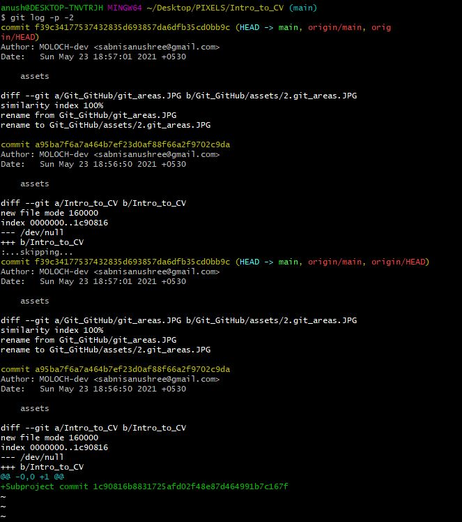
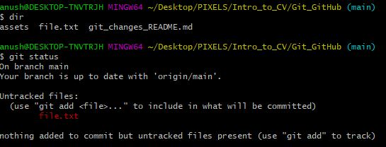
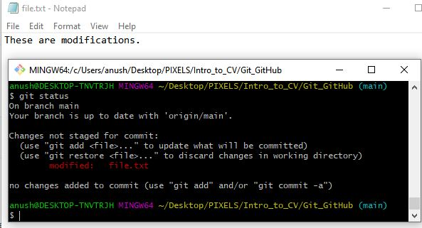
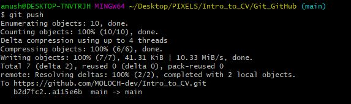
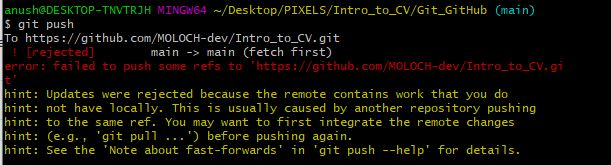
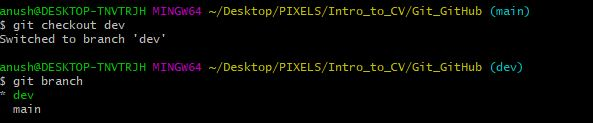

# TABLE OF CONTENTS
- [TABLE OF CONTENTS](#table-of-contents)
- [Version Control in git](#version-control-in-git)
- [Remotes and Local Repositories](#remote-repositories)
  - [Local Remotes](#adding-your-local-repository-as-a-remote)
  - [Fetching from and Pushing to Remotes](#fetching-and-pushing)
- [Three States of a Git file](#states-of-a-git-file)
- [Pulling and Pushing](#git-pull-and-git-push)
- [Git Branching](#git-branching)


# Version Control in Git

* 'Version Control' basically logs changes made to a set of files, and provides the added functionality of reverting back to previous versions if need be
* Git is a 'Distributed Version Control System' (DVCS)
* Multiple 'clients' check out files from this central server
* Since git is a DVCS, the clients don't just check out the latest versions of these files, but alongwith it the entire commit history
* You can verify this by cloning this repository itself, and checking the commit history using the **git log** command
```
  git clone https://github.com/SRA-VJTI/Intro_to_CV.git
  git log -p -2 
```
**git log -p -2** shows the latest 2 modifications to the repository
You should see an output similar to this
<p align="center">
  
</p>

* This has the added advantage of restoring files from one of the client repositories, if any server faces file mishandling.


# Remote Repositories

* A remote repository is a version of your Git Directory on your local machine
* Multiple clients can have remote repositories of the same Git Directory
* When you **git clone** a repository, by default your established remote is **origin**
* You can verify this by running the following commands
```
  git clone https://github.com/SRA-VJTI/Intro_to_CV.git
  git remote -v
```
<p align="center">
  
</p


# Adding your local repository as a remote

* You can add a seperate remote of your local repository
* In doing so, your local files will not be visible on the main Git Directory
* But collaborators can access your local files by using your remote by running the **git fetch** command

Adding your own remote named 'new_remote' :
```
  git clone https://github.com/SRA-VJTI/Intro_to_CV.git
  git remote -v
  git remote add new_remote https://github.com/SRA-VJTI/Intro_to_CV.git
```
Fetching from the new remote:
```
 git fetch new_remote
 
```
<p align="center">
  
</p


# Adding your local repository as a remote

* To get data from any remote repository, for example a remote named 'my_remote', just run
```
 git fetch my_remote
```
---------------------------------------------------------------------------------------------
---------------------------------------------------------------------------------------------
**Using git fetch on a cloned repository**

* By default, the git clone command will set your remote as the origin, as we have seen above
* So to get modified data from the origin after cloning, you can just run 'git fetch origin'
**Note : This will not make any changes to your existing files on your local repository**

---------------------------------------------------------------------------------------------
---------------------------------------------------------------------------------------------


# States of a Git file

<p align="center">
  
</p>


* Git being a version control system needs a way to **track all the changes made to the files in your local repository**
* This is significant when you want your collaborators to be able to view and access the local changes you make to the files.
* Thus, each file in your git repository can be either **tracked** or **untracked**
* To understand this, let's go through the basic Git workflow for a file:


1. **Modified** : Your file gets modified in your **Working Directory**. At this stage, your changed file remains **untracked**, and other collaborators will **not** be able to access the changes you made from the server.
Example - Here we have modified a new file 'file.txt' and are checking whether it is tracked or untracked

<p align="center">
  
</p>


2. **Staged** : Only the changes in the files that you select using the **git add** command will be recorded in the next version of your repository. These files reside in the **Staging Area**. Your changed file is now **tracked**. You can verify this by re-running the **git status** command

Example - We are now tracking previously modified file 'file.txt' using the **git add** command

<p align="center">
  
</p>

If you modify your file again after it has been staged with git add, Git with list it as an untracked file again. You can verify this by running the git status command again.

Example - We have made changes to 'file.txt' and are testing whether it is tracked again

<p align="center">
  
</p>

In this case we will have to git add again. If you have multiple changes and want to track all of them, you can just run **git add .**


<p align="center">
  
</p>

3. **Committed** : Once you perform the **git commit** command, the files you have in your staging area get stored as a new version in your **Local Git Repository**

<p align="center">
  
</p>


Note : The files that you commit will **not** be visible in your **Remote Repository** . 


## git pull and git push

* We have so far studied how to modify a file, track it and store it in our Local Git Repository
* To make these changes visible in your Remote Repository, you need to run **git push** command
* The git push command updates your Remote Repository with content from your local Git Repository

* If you want to publish your project uptil now to your git server, you can run the 'git push' command as follows
```
 git push <remote> <branch>
```

Example : If you want to push changes to the 'main' branch of your 'origin' remote, the command will be
```
 git push origin main
```

By default, git push will push to your configured remote and branch. So you can also run
```
 git push
```
<p align="center">
  
</p>


* If another contributor has already pushed a change into the Remote Repository by running git push, you may get an error like this after running git push

<p align="center">
  
</p>

* This means your Local Git Repository is not up-to-date with the Remote Git Repository
* To fix this, you need to run **git pull**
```
 git pull
```
<p align="center">
  
</p>

* As you can see, if you try to push again after running git pull, it shows no errors


---------------------------------------------------------------------------------------------
---------------------------------------------------------------------------------------------
**Difference between git fetch and git push**

* **git fetch remote_name** will fetch changes from remote_name to your system **but it will not merge the changes with your local repository**

You will notice that after fetching, you still can't push your changes to your Remote Repository as the changes have not been merged with your local repository

<p align="center">
  
</p>

* To merge changes into your **local repository**  you need to run **git merge**

After merging, you can successfully push your changes to your Remote Repository

<p align="center">
  
</p>

* Running **git pull** is equivalent to running **git fetch** and then **git merge**
---------------------------------------------------------------------------------------------
---------------------------------------------------------------------------------------------


## Git Branching

* Git uses a pointer called 'HEAD' to keep track of your commit history to a repository 
* Suppose you want to test out a feature for your repository, you want to publish it to your Remote Repository but you don't yet want to release it before testing
* You can try out features by creating a seperate **branch** of your git repository
* A branch is just another copy of your commit history in git that you can make changes to without **merging** it into your master branch
* By default, git creates a **master** branch for you (you can rename this to **main** or **release** as per your needs)
* You can check which branch you are on by running **git branch**

<p align="center">
  
</p>

* To create a new branch, run the following command

```
 git branch new_branch_name
 git branch
 cat .git/HEAD
 
```
<p align="center">
  
</p>

* Your **HEAD** still points to your master or main branch, even after creating a new branch
* To switch your Local repository branch from master or main to the newly created branch, you can run **git checkout**
```
 git checkout new_branch_name
 git branch
 
```
<p align="center">
  
</p>

* On doing this, your **HEAD** will point to the new branch and all your published changes will be visible in the new branch


## Summary

* Here is a sample workflow for your git repository

<p align="center">
  
</p>


